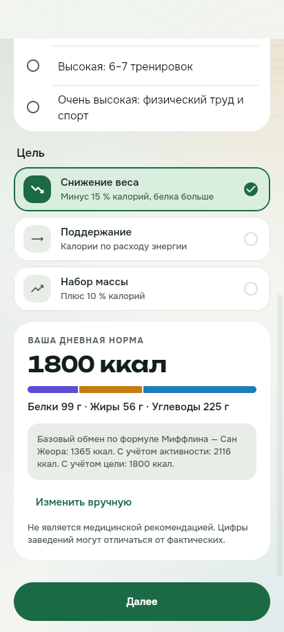
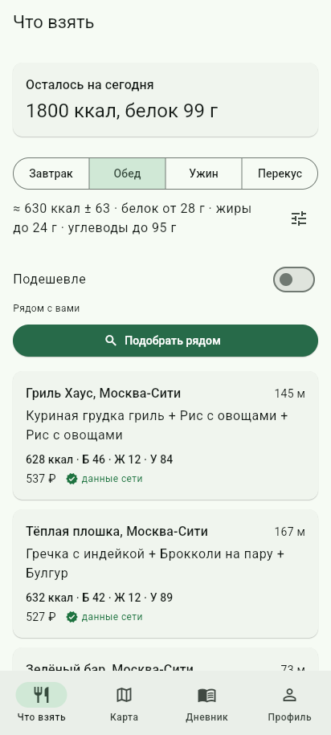
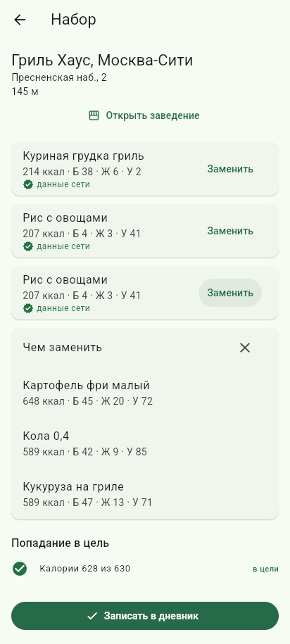
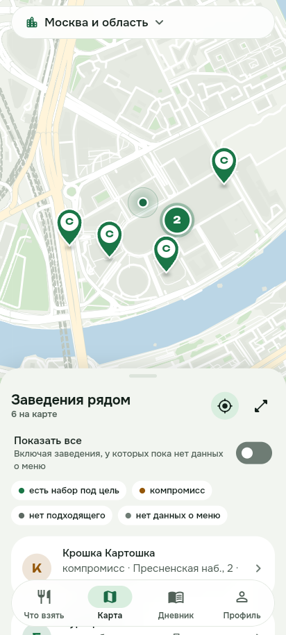
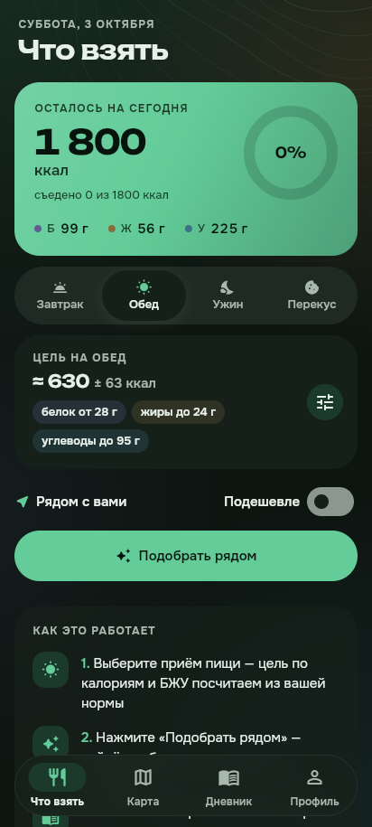
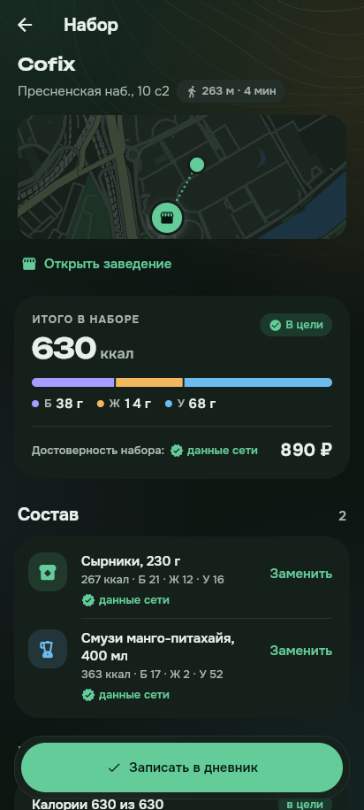
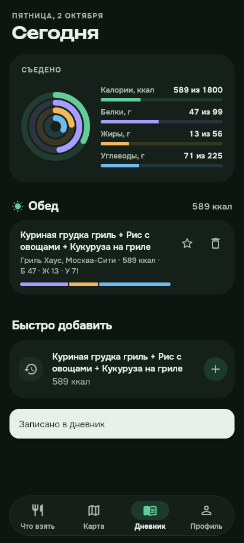
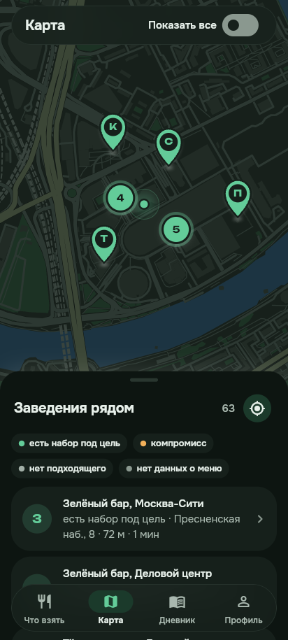

# Норма рядом

Мобильное приложение-гид по питанию вне дома: пользователь задаёт свою норму КБЖУ, а приложение подбирает, что заказать в заведениях рядом, чтобы в неё уложиться, честно показывает, насколько цифрам можно доверять, и записывает приём пищи в дневник.

Курсовой проект. Подробности: [архитектура и решения](docs/decisions.md), [матрица «ТЗ → код → тест»](docs/requirements-matrix.md), [отчёт о проверках](docs/testing.md).

| Онбординг и норма | Подбор рядом | Набор и замена блюда | Карта |
|---|---|---|---|
|  |  |  |  |
|  |  |  |  |

## Состав

| Часть | Технологии |
|---|---|
| `server/` | Kotlin 2.3, JDK 21, Spring Boot 4.1 (Web MVC, Validation, JDBC, Flyway, Security, Cache, Actuator), springdoc-openapi, Caffeine, AWS SDK S3, Tesseract (tess4j) |
| `app/` | Flutter 3.47, Riverpod, go_router, dio, drift (SQLite), freezed + json_serializable, flutter_map, geolocator, image_picker, gen-l10n |
| Данные | PostgreSQL 16 + PostGIS 3.4; S3-совместимое хранилище SeaweedFS для фото меню |
| `contract/` | OpenAPI-контракт сервера и общие контрольные примеры расчёта нормы для сервера и клиента |
| `e2e/` | Playwright: прокликивание веб-сборки приложения и админки против настоящего бэкенда |

```
Flutter (норма и дневник — только на устройстве)
        │  HTTPS, JSON, без идентификатора пользователя
Spring Boot монолит
  catalog        сети, точки, меню, импорт CSV, демо-каталог
  geo            точки рядом (PostGIS, GiST-индекс)
  optimizer      алгоритм подбора без зависимостей от фреймворка
  recommendation подбор у заведения и рядом, замена блюда, цвета карты, пометки блюд, кэш
  intake         фото меню (S3 + OCR), очередь модерации, жалобы на блюда и сообщения о закрытых точках
  admin          веб-админка: импорт, модерация, жалобы, проверка закрытых точек
  web            Problem Details (RFC 9457) для API
        │
PostgreSQL + PostGIS · SeaweedFS (S3) · Caffeine
```

## Быстрый старт

Нужны Docker, JDK 21 и Flutter 3.47.

1. Создайте `.env` по образцу `.env.example`. Хеш пароля администратора — bcrypt, например:
   ```bash
   htpasswd -niBC 10 "" | tr -d ':\n'
   ```
   Команда читает пароль со стандартного ввода, поэтому он не попадает в историю оболочки.
   В `.env` значение хеша берите в одинарные кавычки: `ADMIN_PASSWORD_HASH='$2y$10$...'`.
   `REPORTER_KEY` — случайная строка (например, `openssl rand -hex 32`): ключ HMAC, которым обезличивается
   адрес автора жалобы, чтобы один человек не мог отправить несколько жалоб на одно блюдо или сообщений об одной точке.
   `TRUSTED_PROXIES_REGEX` задают, только если сервер стоит за обратным прокси: регулярное выражение адресов прокси,
   от которых принимается `X-Forwarded-For`. По умолчанию заголовок игнорируется.
2. Соберите и поднимите сервер с базой и хранилищем (профиль `demo` загружает демо-каталог):
   ```bash
   (cd server && ./gradlew bootJar)
   docker compose up -d --build --wait
   ```
   Порты базы, хранилища и сервера открыты только на `127.0.0.1`.
   - API: http://localhost:8080/api/v1, Swagger: http://localhost:8080/swagger-ui.html
   - Админка: http://localhost:8080/admin
3. Запустите приложение:
   ```bash
   cd app
   flutter pub get
   dart run build_runner build --delete-conflicting-outputs
   flutter run --flavor demo --dart-define=API_BASE_URL=http://10.0.2.2:8080
   ```
   Для веба: `flutter run -d chrome --dart-define=API_BASE_URL=http://localhost:8080` и `CORS_ALLOWED_ORIGINS` с адресом страницы.

На iOS-симуляторе (нужны macOS и Xcode) вариантов сборки нет: `open -a Simulator`, затем `flutter run --dart-define=API_BASE_URL=http://localhost:8080` (устройство — из `flutter devices`). Без сервера приложение работает на встроенном демо-каталоге: `flutter run --dart-define=DEMO_SERVER=true --dart-define=TILE_URL_TEMPLATE=` (вы «находитесь» в Москва-Сити). Для HTTP к серверу на своём компьютере в `Info.plist` разрешена только локальная сеть (`NSAllowsLocalNetworking`).

Android собирается в двух вариантах: `--flavor demo` (адрес сервера задаётся в профиле, разрешён HTTP к компьютеру в локальной сети) и `--flavor store` (только HTTPS), например `flutter run --flavor demo`. Готовый демо-APK публикуется в Releases (workflow `Release`); как поставить его на телефон и подключить к серверу на своём компьютере — `docs/install-phone.md`. Сценарий защиты — `docs/demo.md`, схемы и график производительности — `docs/architecture.md`.

Переменные клиента (`--dart-define`): `API_BASE_URL`, `TILE_URL_TEMPLATE` (тайлы карты; при пустом значении используется встроенная векторная карта России с подробными Москвой, областью и Петербургом из OpenStreetMap), `SEARCH_RADIUS_METERS` (радиус подбора, 1500 м), `MAP_RADIUS_METERS` (радиус точек на карте до первого сдвига, 3000 м; дальше карта грузит видимую область).
Публичные тайлы OpenStreetMap допустимы только для разработки и демонстрации (правила tile.openstreetmap.org запрещают
нагрузку от приложений); для выпуска нужен собственный или коммерческий сервер тайлов. Приложение представляется серверу
тайлов идентификатором `ru.normaryadom.norma_ryadom`.

## Проверки

```bash
cd server && LANG=C.UTF-8 ./gradlew check          # тесты, ktlint, detekt, порог покрытия Kover
cd app && flutter analyze --fatal-infos && flutter test --coverage && dart run tool/check_coverage.dart 90
./scripts/e2e.sh                                    # весь стек в Docker + прокликивание в браузере
```

Интеграционные тесты сервера поднимают PostGIS и SeaweedFS через Testcontainers — нужен Docker. Для OCR-тестов нужен Tesseract с русским языком (`tesseract-ocr tesseract-ocr-rus`, см. `.github/workflows/ci.yml`). Имена тестов на русском, поэтому JVM нужна UTF-8 локаль (`LANG=C.UTF-8`).

Контракт API: `contract/openapi.json` сверяется с сервером в тесте; после осознанного изменения API обновите его командой
`./gradlew test --tests '*OpenApiContractIT' -PupdateContract=true`.

## Демо-данные

Профиль `demo` загружает 14 285 реальных заведений из OpenStreetMap в Москве, Московской области и Санкт-Петербурге: 113 сетей и 9 569 отдельных мест, подтверждённых за последние 3 года; явно закрытые отброшены (`tool/demo/build_real_venues.py`). Меню с КБЖУ есть только у сетей с официальной таблицей: Cofix, Бургер Кинг и Крошка Картошка (`tool/menus/`, источники и пересборка — в `docs/menus.md`). Остальные заведения видны на карте по запросу «показать все» с пометкой «нет данных о меню»; их меню добавляются через админку или фото.

## Архив для команды

`python3 tool/team_archive/build.py --practicals <папка с .docx практических>` собирает в `~/Downloads` папку и zip «Норма рядом — архив для команды»: описание проекта, скриншоты, документацию и практические с исправлениями. Сами практические в репозиторий не кладутся. Файлы с меню сетей (HAR, HTML) складываются в `menus-inbox/` — эта папка в `.gitignore`.

## Структура репозитория

```
server/     бэкенд (Kotlin, Spring Boot)
app/        мобильный клиент (Flutter)
contract/   OpenAPI-контракт и контрольные примеры нормы
e2e/        сквозные сценарии Playwright
scripts/    запуск полного E2E
docs/       решения, матрица требований, отчёт о проверках, скриншоты
```
