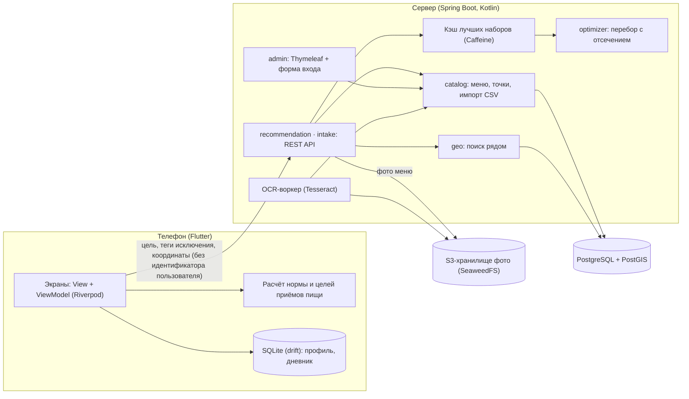
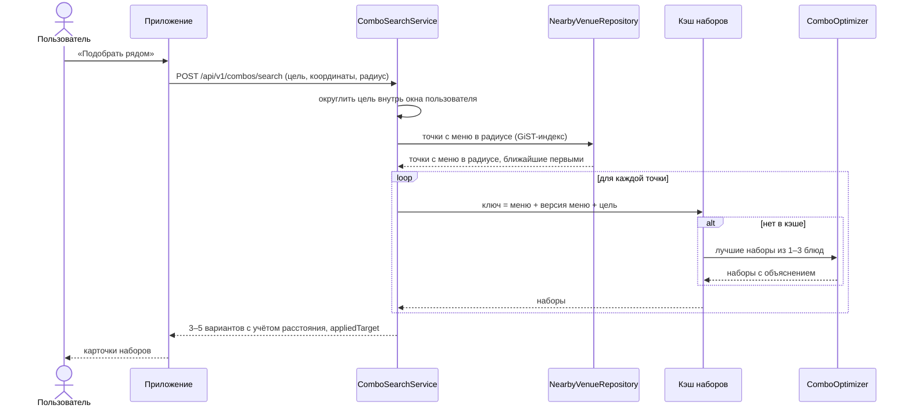
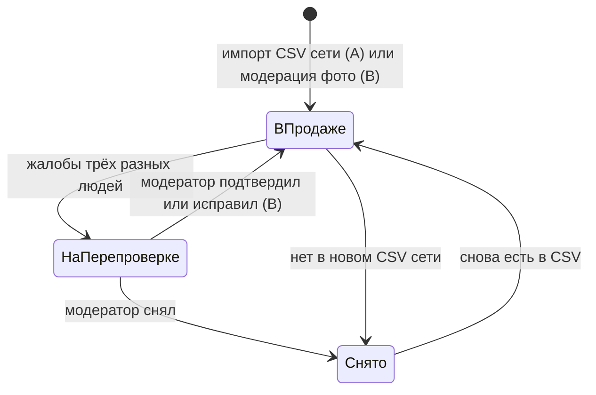
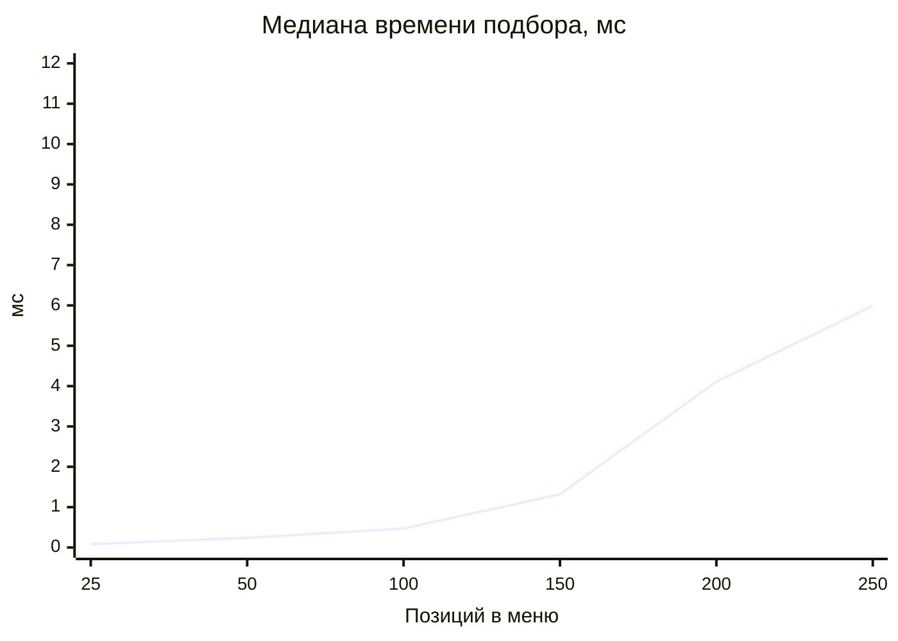

# Архитектура

Схемы рендерятся GitHub (Mermaid). Решения и причины — в `decisions.md`.

## Компоненты

Профиль, норма и дневник не покидают устройство. На сервер уходит только цель приёма пищи и место поиска.

## «Подобрать рядом»

## Жизненный цикл данных о блюде

Каждое изменение повышает версию меню сети или точки, поэтому кэш наборов не отдаёт устаревший ответ.

## Время подбора от размера меню

Медиана по 5 случайным меню каждого размера, 9 замеров после прогрева (`ComboOptimizerPerformanceTest`, данные — `reports/optimizer-timing.csv`). Бюджет — 100 мс.

| Позиций в меню | 25 | 50 | 100 | 150 | 200 | 250 |
|---|---|---|---|---|---|---|
| Медиана, мс | 0,08 | 0,24 | 0,47 | 1,32 | 4,11 | 5,99 |
| 90-й перцентиль, мс | 0,13 | 0,34 | 0,68 | 2,15 | 4,70 | 10,17 |

Рост сверхлинейный (число сочетаний до трёх блюд растёт как n³), но отсечение по калориям и куча фиксированного размера держат 250 позиций на порядок ниже бюджета.
