# Норма рядом

Мобильное приложение-гид по питанию вне дома с подбором блюд под личную норму КБЖУ

Описание проекта («файл правды»)

Тип работы: курсовой проект

Репозиторий: https://github.com/ilzen6/norma-ryadom

Состояние описания: ветка main, коммит 8dfffca, 04.10.2026

## Содержание

- [Сведения о проекте](#сведения-о-проекте)
- [Введение](#введение)
  - [Проблема](#проблема)
  - [Актуальность](#актуальность)
  - [Цель и задачи](#цель-и-задачи)
  - [Объект и предмет](#объект-и-предмет)
  - [Целевая аудитория](#целевая-аудитория)
  - [Отличия реализации от документа идеи](#отличия-реализации-от-документа-идеи)
- [1 Описание продукта](#1-описание-продукта)
  - [1.1 Пользовательские сценарии](#11-пользовательские-сценарии)
  - [1.2 Онбординг и расчёт нормы](#12-онбординг-и-расчёт-нормы)
  - [1.3 Цели приёмов пищи](#13-цели-приёмов-пищи)
  - [1.4 «Подобрать рядом»](#14-подобрать-рядом)
  - [1.5 Набор и замена блюда](#15-набор-и-замена-блюда)
  - [1.6 Дневник](#16-дневник)
  - [1.7 Карта, заведения и кластеры](#17-карта-заведения-и-кластеры)
  - [1.8 Экран заведения](#18-экран-заведения)
  - [1.9 Выбор района](#19-выбор-района)
  - [1.10 Профиль и настройки](#110-профиль-и-настройки)
  - [1.11 Демо-режим без сервера](#111-демо-режим-без-сервера)
  - [1.12 Админ-панель](#112-админ-панель)
- [2 Данные](#2-данные)
  - [2.1 Источники данных](#21-источники-данных)
  - [2.2 Заведения из OpenStreetMap](#22-заведения-из-openstreetmap)
  - [2.3 Меню сетей с официальными КБЖУ](#23-меню-сетей-с-официальными-кбжу)
  - [2.4 Проверка правдоподобия](#24-проверка-правдоподобия)
  - [2.5 Категории и теги исключения](#25-категории-и-теги-исключения)
  - [2.6 Загрузка в базу и повторная загрузка](#26-загрузка-в-базу-и-повторная-загрузка)
  - [2.7 Сети без данных о меню](#27-сети-без-данных-о-меню)
  - [2.8 Тайлы карты из OpenStreetMap](#28-тайлы-карты-из-openstreetmap)
- [3 Технологии и стек](#3-технологии-и-стек)
- [4 Архитектура](#4-архитектура)
  - [4.1 Общая схема](#41-общая-схема)
  - [4.2 Модули сервера](#42-модули-сервера)
  - [4.3 Слои клиента](#43-слои-клиента)
  - [4.4 Путь запроса «Подобрать рядом»](#44-путь-запроса-подобрать-рядом)
  - [4.5 Жизненный цикл данных](#45-жизненный-цикл-данных)
  - [4.6 Развёртывание](#46-развёртывание)
- [5 База данных](#5-база-данных)
  - [5.1 Общие решения](#51-общие-решения)
  - [5.2 Таблицы](#52-таблицы)
  - [5.3 Индексы](#53-индексы)
  - [5.4 Миграции](#54-миграции)
  - [5.5 Геозапрос](#55-геозапрос)
  - [5.6 Идемпотентность и согласованность](#56-идемпотентность-и-согласованность)
- [6 API](#6-api)
  - [6.1 Эндпоинты](#61-эндпоинты)
  - [6.2 Ошибки: Problem Details (RFC 9457)](#62-ошибки-problem-details-rfc-9457)
  - [6.3 Ограничение частоты](#63-ограничение-частоты)
  - [6.4 Приватность, CORS и доверенные прокси](#64-приватность-cors-и-доверенные-прокси)
- [7 Алгоритм подбора](#7-алгоритм-подбора)
  - [7.1 Постановка задачи](#71-постановка-задачи)
  - [7.2 Целевая функция](#72-целевая-функция)
  - [7.3 Перебор с отсечением, куча и диверсификация](#73-перебор-с-отсечением-куча-и-диверсификация)
  - [7.4 Замена блюда](#74-замена-блюда)
  - [7.5 Округление цели и ослабление ограничений](#75-округление-цели-и-ослабление-ограничений)
  - [7.6 Учёт расстояния](#76-учёт-расстояния)
  - [7.7 Кэш](#77-кэш)
  - [7.8 Производительность](#78-производительность)
- [8 Клиент](#8-клиент)
  - [8.1 Экраны и управление состоянием](#81-экраны-и-управление-состоянием)
  - [8.2 Сетевой слой](#82-сетевой-слой)
  - [8.3 Локальная база данных](#83-локальная-база-данных)
  - [8.4 Локализация](#84-локализация)
  - [8.5 Встроенная векторная карта](#85-встроенная-векторная-карта)
  - [8.6 Демо-сервер и проверка эквивалентности](#86-демо-сервер-и-проверка-эквивалентности)
  - [8.7 Доступность, тема и дизайн](#87-доступность-тема-и-дизайн)
  - [8.8 Платформы](#88-платформы)
- [9 Безопасность и приватность](#9-безопасность-и-приватность)
- [10 Тестирование](#10-тестирование)
  - [10.1 Пирамида тестов](#101-пирамида-тестов)
  - [10.2 Виды тестов и соглашения](#102-виды-тестов-и-соглашения)
  - [10.3 Сквозные сценарии](#103-сквозные-сценарии)
  - [10.4 Непрерывная интеграция](#104-непрерывная-интеграция)
  - [10.5 Найденные и исправленные дефекты](#105-найденные-и-исправленные-дефекты)
- [11 Примеры кода](#11-примеры-кода)
  - [11.1 Расчёт нормы](#111-расчёт-нормы)
  - [11.2 Ядро алгоритма подбора](#112-ядро-алгоритма-подбора)
  - [11.3 Геозапрос PostGIS](#113-геозапрос-postgis)
  - [11.4 Идемпотентный импорт меню](#114-идемпотентный-импорт-меню)
  - [11.5 Округление цели внутрь окна](#115-округление-цели-внутрь-окна)
  - [11.6 Problem Details](#116-problem-details)
  - [11.7 Ограничение частоты](#117-ограничение-частоты)
  - [11.8 Жалоба на блюдо](#118-жалоба-на-блюдо)
  - [11.9 ViewModel на Riverpod](#119-viewmodel-на-riverpod)
  - [11.10 Таблица drift](#1110-таблица-drift)
  - [11.11 Виджет-тест](#1111-виджет-тест)
  - [11.12 Шаг сквозного сценария](#1112-шаг-сквозного-сценария)
- [12 Развёртывание и запуск](#12-развёртывание-и-запуск)
  - [12.1 Требования](#121-требования)
  - [12.2 Переменные окружения](#122-переменные-окружения)
  - [12.3 Запуск сервера](#123-запуск-сервера)
  - [12.4 Запуск клиента](#124-запуск-клиента)
  - [12.5 Демо-версия без сервера](#125-демо-версия-без-сервера)
  - [12.6 Запуск проверок](#126-запуск-проверок)
- [13 Ограничения и дальнейшее развитие](#13-ограничения-и-дальнейшее-развитие)
- [Заключение](#заключение)
- [Приложение А. Структура репозитория](#приложение-а-структура-репозитория)
- [Приложение Б. Глоссарий](#приложение-б-глоссарий)

## Сведения о проекте

Документ описывает программный комплекс «Норма рядом» в том виде, в каком он реализован в репозитории. Все числа, версии и сроки взяты из исходного кода, сборочных файлов и отчётов `docs/testing.md`, `docs/architecture.md`, `docs/menus.md`. Там, где реализация расходится с исходным документом «Норма рядом: разбор идеи, анализ рынка и план реализации» (далее — документ идеи, 24.09.2026), описывается реализация, а расхождение указывается явно. Документ предназначен для команды: из него можно переносить текст в пояснительную записку, по нему можно разбираться в устройстве проекта и проверять его.

Таблица 1 — Основные сведения о проекте

| Параметр | Значение |
|---|---|
| Название | «Норма рядом» |
| Тип работы | Курсовой проект |
| Назначение | Подбор наборов блюд в заведениях общепита рядом с пользователем под его норму калорий, белков, жиров и углеводов (КБЖУ), показ достоверности данных и ведение дневника питания |
| Репозиторий | https://github.com/ilzen6/norma-ryadom |
| Состав | `server/` — сервер (Kotlin, Spring Boot); `app/` — мобильный клиент (Flutter); `contract/` — контракт API и общие контрольные примеры; `e2e/` — сквозные сценарии Playwright; `tool/` — подготовка данных; `docs/` — документация |
| Версии | сервер 0.1.0 (`server/build.gradle.kts`), клиент 0.1.0+1 (`app/pubspec.yaml`) |
| Зона работы демо-каталога | Москва, Московская область, Санкт-Петербург |
| Платформы клиента | Android (варианты сборки `demo` и `store`), веб; iOS — только запуск на симуляторе из исходников (см. раздел 12) |

## Введение

### Проблема

Человек, который следит за питанием (снижает вес, набирает мышечную массу или просто соблюдает норму), дома взвешивает продукты и считает КБЖУ по этикеткам. Вне дома — в бизнес-центре, на фудкорте, в кофейне у метро — он оказывается перед меню из десятков позиций и выбирает «на глаз». Ошибка в 150–200 ккал на обед, по оценке документа идеи, съедает весь дневной дефицит. Существующие дневники питания отвечают на вопрос «сколько я съел», но не на вопрос «что взять здесь и сейчас, чтобы уложиться в норму».

При этом данные для ответа существуют. Правила оказания услуг общественного питания (Постановление Правительства РФ № 1515 от 21.09.2020) обязывают исполнителя сообщать потребителю пищевую ценность продукции: калорийность, белки, жиры и углеводы. Крупные сети публикуют таблицы КБЖУ на сайтах и в PDF. Документ идеи отмечает, что Правила утверждены на срок до 1 января 2027 года, поэтому перед защитой нужно проверить их действующую редакцию.

### Актуальность

Документ идеи приводит анализ рынка на сентябрь 2026 года (таблица 2). Иностранные приложения подбора блюд в ресторанах (MenuFit, MacrosMap) не знают российских сетей. Яндекс Еда с февраля 2026 года фильтрует блюда по КБЖУ, но только в доставке и по одному блюду — без подбора сочетаний, без личной нормы и без дневника. Дневники питания (FatSecret, MyFitnessPal, Yazio) не решают задачу выбора на месте, а ресторанные позиции в них часто внесены пользователями и не проверены. Связку «российские сети + личная норма + подбор сочетания блюд под ограничения + честная пометка точности + дневник» никто из перечисленных не реализует.

Таблица 2 — Конкуренты и аналоги (по документу идеи, данные на 24.09.2026)

| Продукт | Что делает | Сильные стороны | Чего нет |
|---|---|---|---|
| MenuFit (США) | Подсказывает, что заказать в ресторане под цель и макросы; ИИ-чат по меню | Около 260 тыс. загрузок на Android; подписка | Нет российских сетей; в отзывах — рекомендации далеки от заданных макросов |
| MacrosMap (США) | База макросов ресторанов, фильтр по диапазону, заведения рядом | Большая база, поиск по макро-целям | Только iPhone, американские сети |
| Яндекс Еда, фильтр «ЗОЖ» (с февраля 2026) | Фильтр блюд по КБЖУ в доставке | Огромный охват, данные от ресторанов | Только доставка; фильтр по одному блюду; нет нормы и дневника |
| FatSecret, MyFitnessPal, Yazio | Дневники питания с большой базой продуктов | Привычка пользователей, штрихкоды | Не отвечают на вопрос «что взять здесь»; ресторанные позиции часто не проверены |
| tastyandpoint.com (неофициальный) | Калькулятор КБЖУ для трёх сетей | Узкая точная задача | Веб, три сети, нет нормы, подбора и карты |

Главный риск рынка, по документу идеи, — Яндекс Еда может добавить подбор сочетаний. Поэтому продукт ориентирован на офлайн-сценарий («зашёл в кафе») и на прозрачность данных. Цифры анализа рынка в рамках этого описания не перепроверялись.

### Цель и задачи

Цель работы — разработать программный комплекс из мобильного приложения и сервера, который по личной норме КБЖУ пользователя подбирает наборы из одного–трёх блюд в заведениях рядом, показывает, насколько цифрам можно доверять, и записывает приём пищи в дневник.

Для достижения цели решены задачи:

1. Рассчитать суточную норму КБЖУ по формуле Миффлина — Сан Жеора с учётом активности, цели и безопасного минимума калорий и разложить её на цели приёмов пищи.
2. Спроектировать модель данных сетей, заведений, блюд, заявок с фото меню и жалоб в PostgreSQL с PostGIS.
3. Разработать алгоритм подбора наборов блюд под жёсткие ограничения по КБЖУ с целевой функцией, правилами состава приёма пищи и диверсификацией результатов.
4. Реализовать геопоиск заведений в радиусе с использованием пространственного индекса.
5. Реализовать REST API с валидацией, единым форматом ошибок (Problem Details) и ограничением частоты запросов.
6. Реализовать приём фото меню с распознаванием текста (OCR), очередь модерации и жалобы пользователей на цифры и на закрытые заведения.
7. Разработать веб-админку для импорта CSV, модерации фото, разбора жалоб и проверки закрытых точек.
8. Разработать мобильный клиент: онбординг, главный экран, результат подбора с заменой блюда, карта, экран заведения, дневник, профиль; хранить персональные данные только на устройстве.
9. Собрать демо-каталог из реальных заведений OpenStreetMap и официальных таблиц КБЖУ сетей.
10. Обеспечить проверку качества: модульные, интеграционные, виджет- и сквозные тесты, статический анализ, непрерывная интеграция.

### Объект и предмет

Объект исследования — процесс выбора блюд при питании вне дома человеком, который соблюдает норму КБЖУ.

Предмет исследования — методы и программные средства подбора наборов блюд под ограничения по КБЖУ с учётом местоположения пользователя и достоверности данных о блюдах.

### Целевая аудитория

Таблица 3 — Целевые пользователи (по документу идеи)

| Персона | Ситуация | Что нужно от приложения |
|---|---|---|
| Худеющий офисный сотрудник | Обедает в бизнес-центре, рядом фудкорт, считает калории в дневнике | Быстрый ответ «что взять до 600 ккал» и запись в дневник в одно касание |
| Любитель фитнеса на наборе | Нужен белок 140–160 г в день, часто ест вне дома | Наборы с высоким белком, точные цифры |
| Человек с ограничениями | Вегетарианец, не ест свинину, не ест орехи | Надёжное исключение блюд и понимание, что данные о составе могут быть неполными |

### Отличия реализации от документа идеи

Таблица 4 — Расхождения реализации с документом идеи

| Документ идеи | Реализация | Причина |
|---|---|---|
| Spring Boot 3 | Spring Boot 4.1.1 | Бесплатная поддержка 3.5 закончилась в июне 2026 года, у 4.0 заканчивается 31.12.2026 (`docs/decisions.md`) |
| Spring Data JDBC | Явный SQL на `JdbcClient` | Геозапросы PostGIS, массивы тегов и `ON CONFLICT` проще писать явным SQL |
| Карта Яндекса (MapKit) | `flutter_map` и собственная встроенная векторная карта из OpenStreetMap и Natural Earth | MapKit требует ключ и не работает в веб-сборке, на которой построены сквозные проверки; запасной вариант предусмотрен документом идеи |
| MinIO для фото | Любое S3-совместимое хранилище, в Docker — SeaweedFS | MinIO больше не публикует образы в Docker Hub, лицензия AGPL неудобна |
| 5–8 сетей с официальными таблицами в одном городе | 14 285 реальных заведений OSM в Москве, области и Петербурге; КБЖУ у трёх сетей (Cofix, Бургер Кинг, Крошка Картошка) | Сайты других сетей недоступны из облачной среды, защищены от ботов или не публикуют БЖУ (раздел 2.7) |
| Статусы заявки NEW, OCR_DONE, APPROVED, REJECTED | Добавлен статус OCR_FAILED | Без него заявка с нераспознаваемым фото осталась бы в очереди навсегда |
| Соус — только вместе с блюдом | Дополнительно: не больше одного соуса в наборе | Иначе алгоритм добирал калории соусами |
| Уровень C — оценка через LLM | Схема БД поддерживает уровень C с диапазоном калорий, но способа создать такие блюда нет | В документе идеи уровень C отнесён к дальнейшему развитию |
| Карта с кластеризацией MapKit | Собственная кластеризация точек на клиенте | Следствие отказа от MapKit |
| Сообщения о закрытых заведениях не предусмотрены | Дата подтверждения точки, сообщения «закрылось / переехало / не нашёл», проверка модератором | Любой справочник заведений стареет |

## 1 Описание продукта

### 1.1 Пользовательские сценарии

Основной сценарий повторяет сценарий защиты из документа идеи и полностью автоматизирован сквозным тестом `e2e/tests/app.demo-scenario.spec.ts`:

1. Пользователь проходит онбординг из трёх шагов: параметры тела и цель, пищевые предпочтения, доступ к геолокации. Приложение рассчитывает и объясняет норму.
2. На главном экране «Что взять» он видит остаток нормы на сегодня, выбирает приём пищи (цель предзаполнена долей нормы) и нажимает «Подобрать рядом».
3. Приложение показывает до пяти вариантов наборов в ближайших заведениях с суммой КБЖУ, расстоянием и ценой.
4. Пользователь открывает набор, видит отклонение по каждому показателю, при желании заменяет одно блюдо и нажимает «Записать в дневник».
5. На вкладке «Карта» он видит заведения, окрашенные по тому, есть ли в них набор под цель, открывает заведение, смотрит меню с пометками и значками достоверности, может собрать набор в этом заведении.
6. Если цифры в меню не совпадают с фактическими, пользователь отправляет жалобу; если заведение закрылось — сообщение о закрытии; если у заведения нет данных — фото меню.

Дополнительные сценарии:

- Демонстрация без сервера: веб-сборка или сборка с `DEMO_SERVER=true` работает на встроенном каталоге, подбор выполняется прямо в приложении по тем же правилам, что на сервере (раздел 1.11).
- Работа модератора: вход в админку, импорт CSV меню и точек сети, перенос распознанного фото меню в меню заведения, разбор жалоб на блюда и сообщений о закрытых точках (раздел 1.12). Автоматизирован тестом `e2e/tests/admin.moderation.spec.ts`.

### 1.2 Онбординг и расчёт нормы

Онбординг состоит из трёх шагов (рисунок 1): параметры тела (пол, возраст, рост, вес, уровень активности, цель), пищевые предпочтения и согласие на геолокацию. Без согласия пользователь выбирает район вручную (раздел 1.9).

<p> 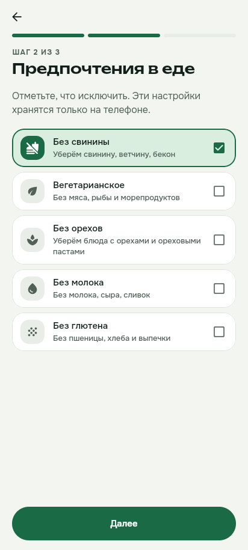 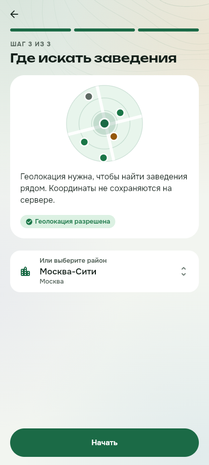</p>

Рисунок 1 — Онбординг: норма с объяснением, предпочтения, геолокация

Норма рассчитывается на устройстве (`app/lib/domain/nutrition/norm_calculator.dart`, листинг 6). Базовый обмен (BMR, ккал/сутки) — по формуле Миффлина — Сан Жеора:

- для мужчин: BMR = 10 × вес (кг) + 6,25 × рост (см) − 5 × возраст + 5;
- для женщин: BMR = 10 × вес (кг) + 6,25 × рост (см) − 5 × возраст − 161.

Суточный расход (TDEE) равен BMR, умноженному на коэффициент активности (таблица 5). Калорийность нормы равна расходу, умноженному на коэффициент цели, с округлением до 10 ккал (таблица 6).

Таблица 5 — Коэффициенты активности (`ActivityLevel`)

| Уровень | Коэффициент |
|---|---|
| Сидячий образ жизни (`sedentary`) | 1,2 |
| Лёгкая активность (`light`) | 1,375 |
| Умеренная, 3–5 тренировок (`moderate`) | 1,55 |
| Высокая (`high`) | 1,725 |
| Очень высокая (`veryHigh`) | 1,9 |

Таблица 6 — Коэффициенты цели (`Goal`) и белок по умолчанию

| Цель | Коэффициент калорий | Белок, г на кг веса |
|---|---|---|
| Снижение веса (`lose`) | 0,85 (дефицит 15%, не более 20%) | 1,6 |
| Поддержание (`maintain`) | 1,0 | 1,2 |
| Набор (`gain`) | 1,10 | 1,6 |

Жиры — 0,9 г на кг веса, но не меньше 20% калорий нормы; углеводы — остаток калорий после белков (4 ккал/г) и жиров (9 ккал/г), делённый на 4. Если рассчитанная калорийность ниже безопасного минимума (1200 ккал для женщин, 1500 ккал для мужчин), норма поднимается до минимума, а флаг `limitedBySafeMinimum` позволяет объяснить это пользователю. Норму можно задать вручную, но ниже безопасного минимума она не принимается (`NormCalculator.isSafeManualNorm`); при смене пола ручная норма, ставшая небезопасной, сбрасывается.

Пример (контрольный пример из `contract/norm-cases.json` и сценарий защиты): женщина, 25 лет, 165 см, 62 кг, умеренная активность, снижение веса. BMR = 620 + 1031,25 − 125 − 161 = 1365,25 ккал; расход = 1365,25 × 1,55 = 2116,14 ккал; норма = 2116,14 × 0,85 ≈ 1798,7 → 1800 ккал. Белок 1,6 × 62 = 99 г; жиры max(0,9 × 62; 1800 × 0,2 / 9) = 55,8 → 56 г; углеводы (1800 − 99 × 4 − 56 × 9) / 4 = 225 г. Под нормой приложение показывает объяснение расчёта.

Та же формула реализована на сервере только в тесте `NormCalculationContractTest`; обе реализации проверяются по восьми контрольным примерам файла `contract/norm-cases.json`. На всех экранах онбординга, главном экране и в профиле показывается дисклеймер «Не является медицинской рекомендацией. Цифры заведений могут отличаться от фактических.»

Пищевые предпочтения превращаются в теги исключения (`DietPreference`), которые уходят на сервер вместе с целью (таблица 7). На шаге предпочтений и в профиле показывается предупреждение: «Отметки берутся из состава, который публикует сеть. При аллергии уточняйте состав у персонала.»

Таблица 7 — Предпочтения и теги исключения

| Предпочтение | Исключаемые теги |
|---|---|
| Без свинины | `pork` |
| Вегетарианское | `meat`, `fish`, `seafood` |
| Без орехов | `nuts` |
| Без молока | `milk` |
| Без глютена | `gluten` |

Всего на сервере 11 тегов (`DietTag`): `meat`, `pork`, `beef`, `chicken`, `fish`, `seafood`, `nuts`, `milk`, `gluten`, `egg`, `soy`. Тег `meat` выводится автоматически, если у блюда есть `pork`, `beef` или `chicken` (`DietTag.withImplied`).

### 1.3 Цели приёмов пищи

Цель приёма пищи строит `MealPlanner` (`app/lib/domain/nutrition/meal_planner.dart`) из нормы, типа приёма пищи и предпочтений (таблица 8). Приём пищи по умолчанию выбирается по времени суток, цель можно поправить вручную в листе «Цель приёма пищи» с проверкой границ.

Таблица 8 — Правила построения цели приёма пищи

| Параметр | Правило |
|---|---|
| Доли нормы | завтрак 25%, обед 35%, ужин 30%, перекус 10% |
| Калории | норма × доля, в пределах 100–2000 ккал |
| Допуск по калориям | 10% от калорий цели, в пределах 50–500 ккал |
| Минимум белка | белок нормы × доля × 0,8 |
| Максимум жиров | жиры нормы × доля × 1,2 |
| Максимум углеводов | углеводы нормы × доля × 1,2 |
| Исключения | объединение тегов выбранных предпочтений |

Для нормы из примера цель обеда — 630 ккал ± 63, белок не меньше 27,7 г, жиры не больше 23,5 г, углеводы не больше 94,5 г. Сквозной тест проверяет строку «≈ 630 ккал ± 63» на главном экране.

### 1.4 «Подобрать рядом»

Главный экран (рисунок 2) показывает карточку «Осталось на сегодня» (норма минус записанное в дневнике), переключатель приёма пищи, цель и кнопку «Подобрать рядом». Запрос `POST /api/v1/combos/search` содержит цель, координаты и радиус поиска 1500 м (`SEARCH_RADIUS_METERS`). Сервер округляет цель внутрь окна пользователя, находит заведения с меню в радиусе, от каждой сети берёт ближайшую точку и возвращает до пяти вариантов с учётом качества набора и расстояния (раздел 7). В ответе есть `appliedTarget` — цель, по которой реально шёл поиск; ею пользуются экран набора и замена блюда.

<p>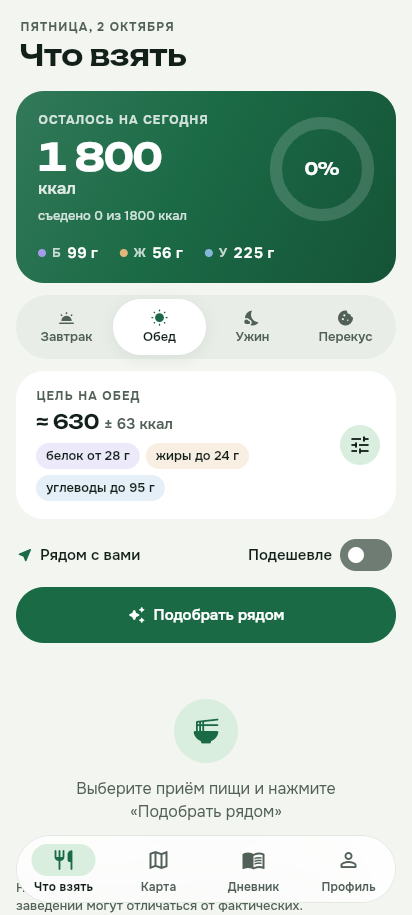 </p>

Рисунок 2 — Главный экран и результаты подбора рядом

Опция «подешевле» добавляет к оценке набора штраф за цену. Если подходящих наборов нет, экран честно сообщает об этом; при ошибке сети показывается сообщение и кнопка «Повторить». Если пока идёт поиск пользователь сменил цель, устаревший ответ отбрасывается (номер поколения запроса, листинг 14). Если доступа к геолокации нет, поиск идёт от центра выбранного района с предупреждением.

### 1.5 Набор и замена блюда

Экран набора (рисунок 3) показывает блюда, сумму КБЖУ, цену, расстояние и проверку каждого показателя: значение, цель и отклонение (в виде «Калории N из M», «Белок N г, нужно от M г»). Достоверность набора — худший уровень среди входящих блюд. Кнопка «Заменить» у блюда запрашивает `POST /api/v1/combos/replace`: остальные блюда фиксируются, сервер перебирает замены на этой позиции, отбрасывает наборы, нарушающие ограничения или правила состава, и возвращает лучшие по оценке. «Записать в дневник» добавляет набор одним касанием; на время запроса кнопки блокируются, чтобы двойное нажатие не создавало дубли.

<p>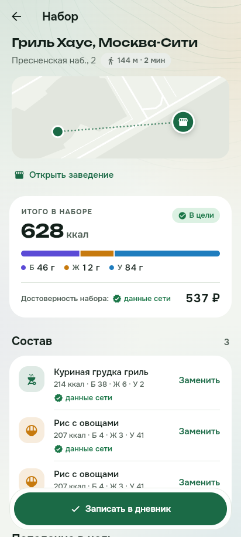  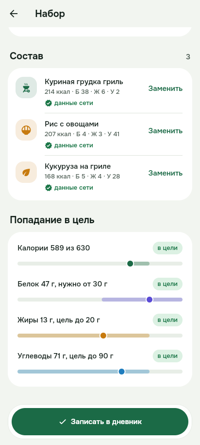</p>

Рисунок 3 — Набор с отклонениями, список замен и пересчитанный набор

### 1.6 Дневник

Дневник (рисунок 4) показывает приёмы пищи за текущий день и прогресс по калориям, белкам, жирам и углеводам относительно нормы. Записи можно отмечать избранными и добавлять снова из избранного и истории. День обновляется при возвращении приложения из фона, поэтому после полуночи дневник не остаётся на вчерашнем дне. Дневник хранится только на устройстве (таблица `DiaryRecords`, раздел 8.3).

<p>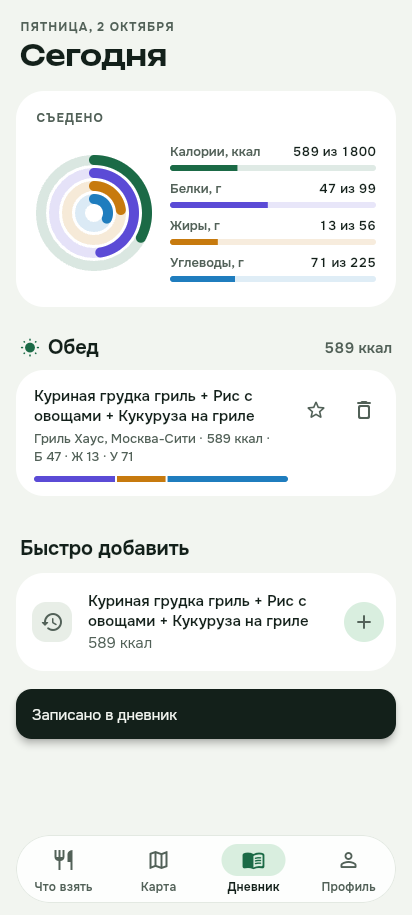 </p>

Рисунок 4 — Дневник в светлой и тёмной теме

### 1.7 Карта, заведения и кластеры

Вкладка «Карта» (рисунок 5) показывает заведения на встроенной векторной карте. До первого сдвига карта загружает точки в радиусе 3000 м от пользователя (`MAP_RADIUS_METERS`), дальше — точки видимой области: до 400 ближайших к центру, радиус от 500 м до 30 км (`MapViewportController`, `mapVenueLimit`). Близкие точки объединяются в кластеры радиусом 60 логических пикселей до 17-го масштаба; нажатие на кластер приближает карту. Подпись станции метро показывается, только если не пересекается с точкой, кластером или другой подписью.

Цвет точки показывает, есть ли в заведении набор под текущую цель: зелёный — «есть набор под цель» (`GOOD`), жёлтый — «компромисс» (`COMPROMISE`, набор есть только при ослабленных ограничениях), серый — «нет подходящего» (`NONE`). По умолчанию показываются только заведения с данными о меню; переключатель «Показать все» добавляет остальные с пометкой «нет данных о меню». Легенда дублирует цвета словами.

Список заведений — шторка с тремя положениями: заголовок, половина экрана, весь экран; во весь экран у списка своя шапка с кнопкой «Карта», жест «Назад» сворачивает список. Для каждого заведения показываются расстояние и время пешком. Кнопка с названием города переключает регионы с подробной картой (Москва и область, Санкт-Петербург); на отдалении видна вся Россия.

<p> 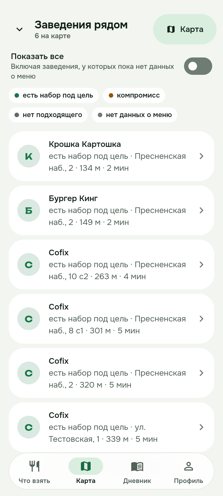 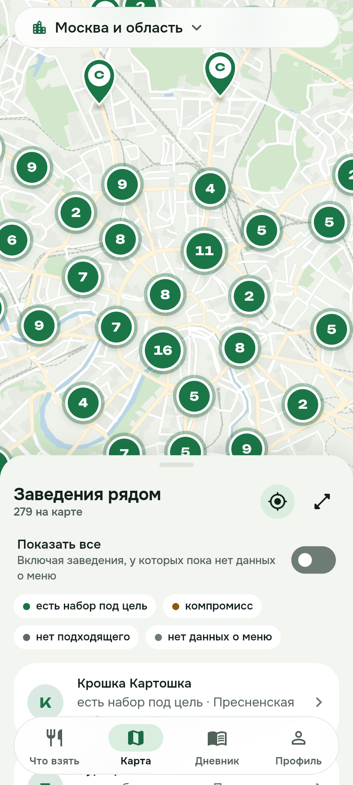</p>

Рисунок 5 — Карта с цветными точками, список заведений на весь экран, карта Москвы и области

### 1.8 Экран заведения

Экран заведения (рисунок 6) содержит название, сеть, адрес, мини-карту, дату подтверждения точки и меню. При переданной цели меню отсортировано по близости к цели, у каждого блюда — КБЖУ, цена, значок достоверности и пометка с причиной (таблица 9). Кнопка «Собрать обед здесь» запускает подбор в рамках одного заведения (`POST /api/v1/combos/search` с `venueId`).

<p>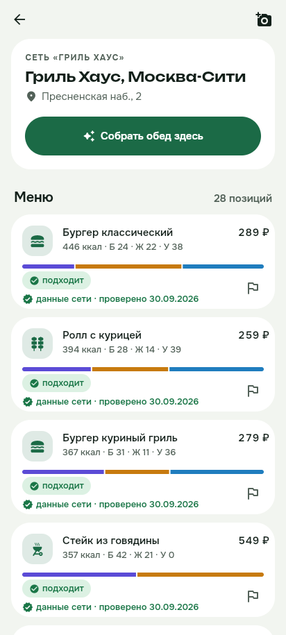 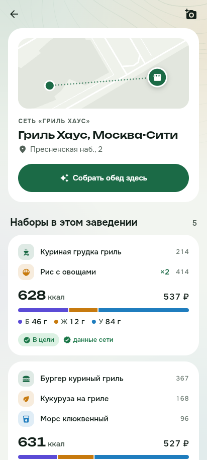 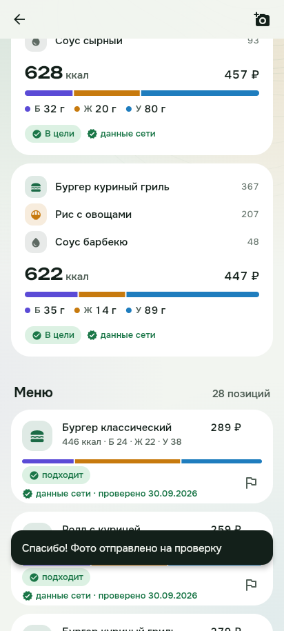</p>

Рисунок 6 — Меню заведения с пометками, наборы в заведении, отправленное фото меню

Таблица 9 — Пометки блюд (`DishAssessor`)

| Пометка | Условие | Причины |
|---|---|---|
| «не подходит» (`NOT_FITS`) | Есть исключённый тег, или калории больше верхней границы цели, или жиры больше максимума, или углеводы больше максимума | «есть {тег}», «калорий больше цели на N», «жиры больше цели на N г», «углеводы больше цели на N г» |
| «можно, но…» (`PARTIAL`) | Блокирующих причин нет, но белка меньше 75% от пропорциональной доли (минимум белка цели × калории блюда / калории цели) или данные — оценка (уровень C) | «мало белка», «цифры — оценка» |
| «подходит» (`FITS`) | Нет ни блокирующих причин, ни предупреждений | — |

Значок достоверности показывает источник цифр (таблица 10). Уровень A ставится при импорте официальной таблицы сети, уровень B — при переносе строк из фото меню модератором или при исправлении цифр модератором после жалоб. Уровень C предусмотрен схемой базы (обязателен диапазон калорий `kcal_low`–`kcal_high`), в оценке набора он штрафуется сильнее всего, но в текущей версии способа создать блюдо уровня C нет.

Таблица 10 — Уровни достоверности данных

| Уровень | Источник | Как показывается | Штраф в оценке набора |
|---|---|---|---|
| A — данные сети | Официальная таблица КБЖУ сети (импорт CSV) | Зелёный значок «данные сети · проверено {дата}» | 0 |
| B — из меню заведения | Фото меню или стенда, распознанное и проверенное модератором; исправление модератором | Значок «из меню заведения» с датой | 0,15 |
| C — оценка | Не реализовано (схема поддерживает) | Серый значок «оценка ≈ {от}–{до} ккал» | 0,6 |

Актуальность точки. У точки хранится дата последнего подтверждения (`confirmed_on`). Экран заведения показывает «Точка подтверждена: {дата}»; если дата старше 548 дней (около полутора лет) — «Точку давно не проверяли … — уточните перед походом»; если даты нет — «Когда точку проверяли, неизвестно — уточните перед походом». Кнопка «Заведение закрыто или переехало?» открывает выбор «Закрылось», «Переехало», «Не нашёл на месте». Когда сообщения отправят три разных человека, точка пропадает из поиска до решения модератора. Решение «работает» возвращает точку и обновляет дату подтверждения, решение «закрыто» снимает её и запоминает дату решения; повторная загрузка точек не возвращает закрытую точку, пока источник не подтвердит её датой позже решения.

Фото меню. Значок камеры позволяет сфотографировать меню или стенд или выбрать снимок из галереи; фото уходит в очередь распознавания и модерации, пользователь видит «Спасибо! Фото отправлено на проверку».

Жалоба на блюдо. Кнопка «Цифры не совпадают» открывает поле для описания (до 500 символов, например «на стенде 520 ккал»). После жалоб трёх разных людей блюдо уходит на перепроверку и не участвует в подборе.

### 1.9 Выбор района

Без доступа к геолокации поиск идёт от центра района. Район выбирается в шторке с поиском и группами «Москва», «Московская область», «Санкт-Петербург» (рисунок 7); всего 33 места (`app/lib/domain/models/district.dart`). Поиск не различает «е» и «ё», шторка поднимается над клавиатурой. По умолчанию используется «Москва-Сити».

### 1.10 Профиль и настройки

Профиль (рисунок 7) показывает параметры, норму и предпочтения, позволяет изменить их, включить или выключить геолокацию, выбрать район и задать адрес сервера с проверкой связи («Проверить и сохранить»). Сборка `demo` разрешает HTTP к компьютеру в локальной сети, сборка `store` — только HTTPS, кроме `127.0.0.1`, `localhost` и `10.0.2.2`. Кнопка «Удалить все данные» удаляет профиль и дневник и выполняет `VACUUM` локальной базы.

<p>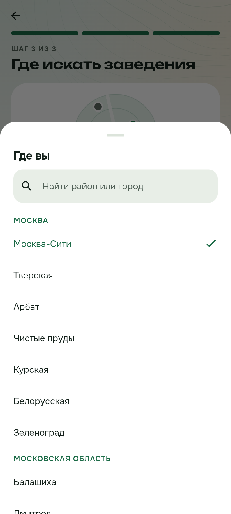 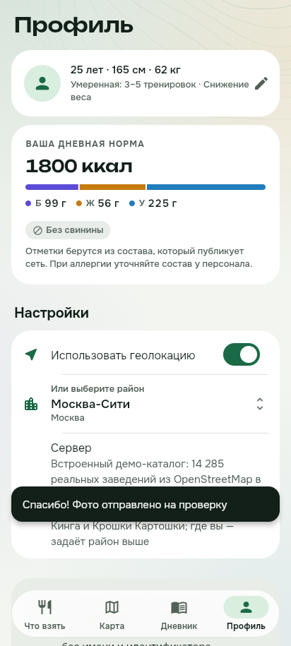 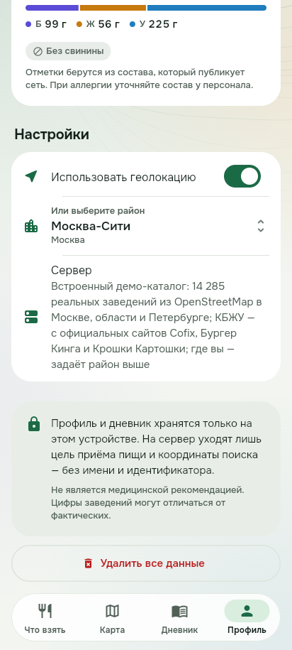</p>

Рисунок 7 — Шторка выбора района, профиль и настройки

### 1.11 Демо-режим без сервера

Сборка с параметром `--dart-define=DEMO_SERVER=true` работает без сервера. В HTTP-клиент dio подставляется адаптер `DemoServerAdapter` (`app/lib/data/demo/demo_server.dart`), который отвечает на те же запросы, что и сервер, по встроенному каталогу `app/assets/demo/catalog.json`: 113 сетей с 4716 точками, 596 блюд трёх сетей с официальными КБЖУ и 9569 отдельных мест. Подбор, оценка блюд, цвета точек и замены считаются в `demo_engine.dart` — переносе серверного алгоритма на Dart. Местоположение фиксировано — Москва-Сити (55,7495; 37,5374). Жалобы и сообщения о закрытии в демо-режиме не сохраняются, фото меню возвращает условный номер заявки. Совпадение демо-режима с сервером проверяется контрактным тестом (раздел 8.6). Каталог пересобирается из CSV сервера командой `dart run tool/build_demo_catalog.dart`. В таком режиме собираются веб-демо и APK `norma-ryadom-offline.apk`, который workflow `Release` публикует в GitHub Releases.

### 1.12 Админ-панель

Админка — серверные страницы Thymeleaf по адресу `/admin` с формой входа и CSRF-защитой (рисунок 8). Пароль администратора хранится только как bcrypt-хеш в переменной окружения; не больше 10 попыток входа с адреса за 15 минут.

<p>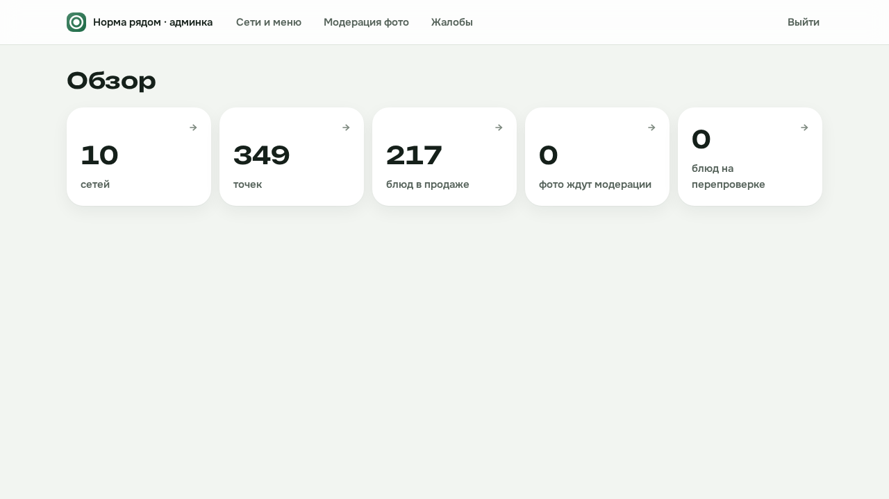 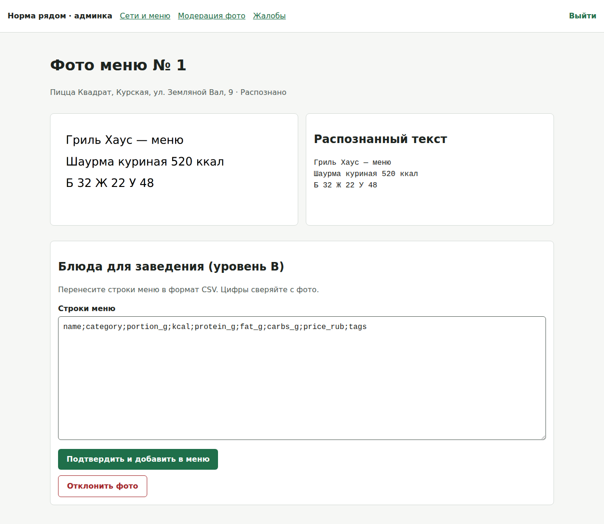</p>

Рисунок 8 — Главная страница админки и модерация фото меню

Таблица 11 — Страницы и действия админки

| Раздел | Адрес | Действия |
|---|---|---|
| Главная | `/admin` | Число сетей, блюд, точек, открытых заявок с фото, блюд на перепроверке и точек на проверке |
| Сети | `/admin/chains`, `/admin/chains/{id}` | Создание сети (название, страница КБЖУ); импорт CSV меню с адресом источника (уровень A); импорт CSV точек; просмотр блюд и точек; ошибки CSV построчно |
| Модерация фото | `/admin/moderation`, `/admin/moderation/{id}` | Просмотр фото и распознанного Tesseract текста; ввод строк меню в формате CSV и перенос в меню заведения (уровень B); отклонение |
| Жалобы на блюда | `/admin/reviews` | Блюда на перепроверке с причинами жалоб: подтвердить, исправить цифры (уровень B), снять с продажи |
| Закрытые точки | `/admin/venue-reviews` | Точки на проверке с числом сообщений по причинам: «работает» (возвращает в поиск, дата подтверждения — сегодня) или «закрыто» (точка снимается, дата решения записывается в `closed_on`) |

<p>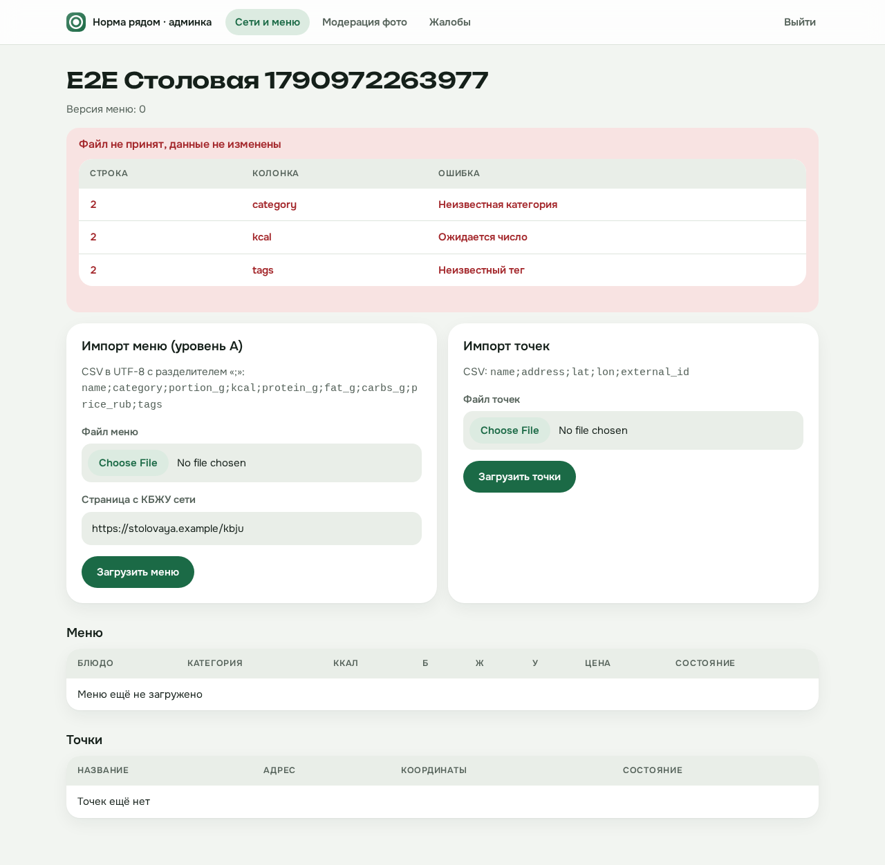 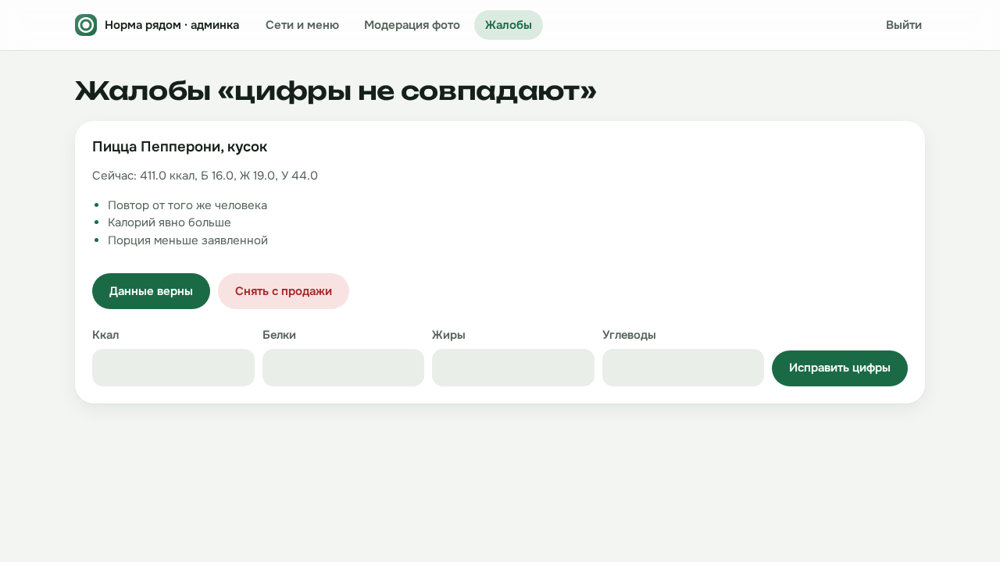</p>

Рисунок 9 — Ошибки CSV построчно и очередь жалоб на блюда

Формат CSV меню — разделитель «;», кодировка UTF-8 (с BOM или без), заголовок `name;category;portion_g;kcal;protein_g;fat_g;carbs_g;price_rub;tags`. Категории: `main`, `side`, `salad`, `drink`, `dessert`, `sauce`; теги перечисляются через запятую. Формат CSV точек — `name;address;lat;lon;external_id` и необязательная колонка `confirmed_on` (дата ГГГГ-ММ-ДД). Файл в другой кодировке отклоняется целиком; ошибки строк (обязательное поле, слишком длинное значение, не число, вне диапазона, неизвестная категория или тег, дубликат) показываются с номером строки и колонкой, и тогда файл не импортируется.
## 2 Данные

### 2.1 Источники данных

Ценность продукта определяется точностью цифр, поэтому в демо-каталог попадают только данные из проверяемых источников: заведения — из OpenStreetMap, КБЖУ — только из официальных таблиц сетей. Цифры не придумываются и не берутся из агрегаторов. Общая схема подготовки данных показана на рисунке 10.

Таблица 12 — Источники данных

| Данные | Источник | Лицензия и условия | Где в репозитории |
|---|---|---|---|
| Заведения общепита (название, бренд, координаты, адрес, дата подтверждения) | OpenStreetMap, выгрузка России с Geofabrik | ODbL, требуется указание источника | `tool/basemap/build_tiles.py`, `tool/demo/` → `server/src/main/resources/demo/real/*-venues.csv` |
| Границы зоны работы | Natural Earth (`ne_10m_admin_1_states_provinces`) | Общественное достояние | `tool/demo/build_areas.py` → `tool/demo/areas.json` |
| Меню с КБЖУ | Официальные сайты и прейскуранты сетей Cofix, Бургер Кинг, Крошка Картошка | Факты, опубликованные сетью для потребителей, с указанием источника и даты | `tool/menus/` → `server/src/main/resources/demo/real/*-menu.csv` |
| Статусы сетей (переименования, уход с рынка) | Новостные публикации, проверены на 03.10.2026 | — | `tool/demo/chain_status.json` |
| Векторная подложка карты | OpenStreetMap (регионы) и Natural Earth (вся Россия) | ODbL; общественное достояние | `tool/basemap/` → ветка `basemap-data` → `app/assets/map/` |
| Блюда уровня B | Фото меню от пользователей после модерации | — | API и админка |

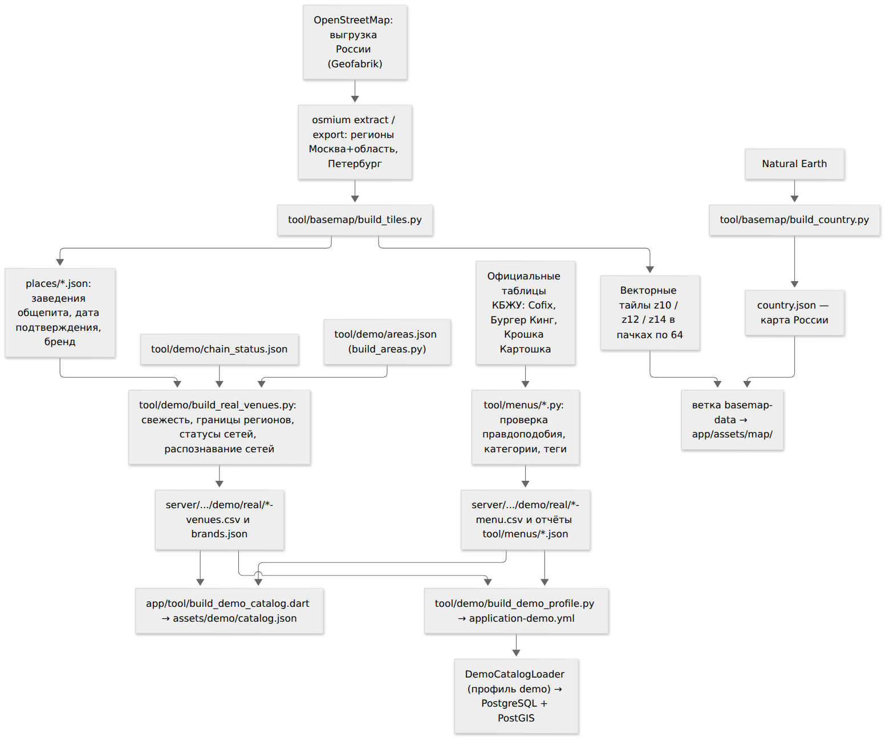

Рисунок 10 — Конвейер подготовки данных демо-каталога и карты

### 2.2 Заведения из OpenStreetMap

Выгрузку выполняет workflow `.github/workflows/basemap.yml` (запускается при изменениях в `tool/basemap/`): скачивает `russia-latest.osm.pbf` с Geofabrik, вырезает утилитой `osmium extract` два региона по прямоугольникам из `tool/basemap/regions.py` («Москва и область» — широта 54,25–56,97, долгота 35,14–40,21; «Санкт-Петербург» — 59,60–60,25 и 29,40–30,80) и экспортирует их в GeoJSON с отметками времени правок. Скрипт `build_tiles.py` строит тайлы карты (раздел 2.8) и попутно собирает заведения с тегом `amenity` из набора `restaurant`, `cafe`, `fast_food`, `food_court`, `bar`, `pub` в файлы `places/<регион>.json`.

Явно закрытые заведения отбрасываются уже на этом шаге (функция `is_closed`): теги жизненного цикла (`disused:`, `abandoned:`, `was:`, `demolished:`, `removed:`, `razed:`, `destroyed:` перед `amenity`), `disused=yes`, `abandoned=yes`, `opening_hours=closed` или `off`, наличие `end_date`, закрытый доступ (`access=private`, `no`, `customers_only`) и слова «закрыт», «closed», «не работает» в названии. Дата подтверждения точки — самая поздняя из даты последней правки объекта и тегов `check_date`, `survey:date`, `check_date:opening_hours`, `check_date:amenity`, `source:date`. Если у точки нет адреса, берётся адрес ближайшего здания в пределах 60 м.

Скрипт `tool/demo/build_real_venues.py` (общие функции — `venue_sources.py`) превращает выгрузку в демо-каталог:

1. Фильтр свежести: остаются места, подтверждённые не раньше чем за 3 года до самой поздней даты в выгрузке (`FRESH_YEARS = 3`). Даты, в которые одним днём «подтверждено» больше 100 мест (массовые правки, `MASS_EDIT_PLACES`), не считаются подтверждением. Безымянные места и места с символами `;` и `"` в адресе или названии отбрасываются.
2. Зона работы: точка должна попадать в границы Москвы, Московской области или Петербурга из `areas.json`. В области к адресу добавляется ближайший город (если он ближе 15 км).
3. Статусы сетей из `chain_status.json`: переименованные сети показываются под новым названием, точки сетей со статусом «неясно» не берутся (таблица 13).
4. Распознавание сетей: сеть — это бренд из тега `brand`, встречающийся не меньше 5 раз, или название без бренда, которое встречается не меньше 10 раз и не является общим словом («кафе», «кебаб», «столовая» и другие — всего 37 слов в списке `GENERIC_NAMES`). Написания сводятся ключом с транслитерацией и без знаков, поэтому «Бургер Кинг» и «Burger King» дают одну сеть; отображается самое частое написание с заглавной буквы.
5. Повторы (то же название и координаты, округлённые до 4 знаков) отбрасываются. Внешний идентификатор точки — `osm-<широта>-<долгота>` с 5 знаками после запятой.

Результат — файл точек на каждую сеть, файл `places-venues.csv` для отдельных мест и `tool/demo/brands.json` со списком сетей. Скрипт `build_demo_profile.py` собирает из них профиль `server/src/main/resources/application-demo.yml`. В текущем каталоге 14 285 заведений: 4716 точек 113 сетей и 9569 отдельных мест.

Таблица 13 — Статусы сетей (`tool/demo/chain_status.json`, проверено 03.10.2026)

| Сеть в OSM | Статус | Как показывается |
|---|---|---|
| KFC | переименована | Rostic's |
| Pizza Hut | переименована | ПиццаН |
| One Price Coffee | переименована | One Plus Coffee |
| Subway | неясно (распался на несколько брендов) | точки не берутся |
| Art Lunch | неясно, нет подтверждения | точки не берутся |
| Costa | неясно, нет подтверждения | точки не берутся |

### 2.3 Меню сетей с официальными КБЖУ

Таблица 14 — Меню с официальными КБЖУ (`docs/menus.md`, отчёты `tool/menus/*.json`)

| Сеть | Источник | Дата данных | Позиций | Пропущено строк | Скрипт |
|---|---|---|---|---|---|
| Cofix | Сайт заказа https://msk.cofix.global/ (встроен в cofix.global/ru-ru/menu/moscow/); КБЖУ на 100 г пересчитаны на порцию | 03.10.2026 | 252 | 8 | `tool/menus/cofix.py` |
| Бургер Кинг | «Сведения об основных потребительских свойствах», приложение 1 к прейскуранту (PDF); значения на порцию | 13.08.2024 | 299 | 68 | `tool/menus/burger_king.py` (нужен `pdftotext`) |
| Крошка Картошка | https://www.kartoshka.com/menu/; КБЖУ на 100 г пересчитаны на вес порции; цен на сайте нет | 03.10.2026 | 45 | 0 | `tool/menus/kroska_kartoska.py` |

Всего в демо-каталоге 596 блюд. Рядом с каждым скриптом лежит отчёт `<сеть>.json`: адрес и дата источника, число позиций, список пропущенных строк с причиной и примечания о пересчёте. Общий модуль `tool/menus/common.py` нормализует названия, пересчитывает значения, определяет категорию и теги и записывает CSV в формате импорта сервера. После пересборки меню нужно выполнить `python3 tool/demo/build_demo_profile.py`, затем `cd app && dart run tool/build_demo_catalog.dart` и обновить эталон `./gradlew test --tests '*DemoComboContractTest' -PupdateContract=true`.

### 2.4 Проверка правдоподобия

Каждая строка меню сверяется с энергетической ценностью макронутриентов (функция `plausible`): оценка 4 · Б + 9 · Ж + 4 · У не должна отличаться от заявленных калорий больше чем на max(40 ккал; 25% от большего из двух значений). Строки, где цифры не сходятся или КБЖУ неполное, не попадают в каталог и записываются в отчёт с причиной, в виде «калории не сходятся с БЖУ: {заявлено} против {оценка}». Повторные названия внутри сети отбрасываются. Сервер дополнительно проверяет диапазоны при импорте: калории 0–5000, белки, жиры и углеводы 0–1000 г, порция 0,1–5000 г, цена 0–100 000 руб.

### 2.5 Категории и теги исключения

Категория блюда (`main`, `side`, `salad`, `drink`, `dessert`, `sauce`) определяется по ключевым словам названия, если источник её не задаёт. Теги исключения строятся из трёх источников:

- состав и аллергены, опубликованные сетью; фразы «может содержать следы», «производится на предприятии» и подобные не считаются;
- название блюда — с запасом: мясо и рыба по корням слов («куриц», «бекон», «лосос»…), бургер без указания другого мяса считается говяжьим, «сырники» дают молоко и глютен, «карбонара» — свинину, молоко и яйцо, молочные кофейные напитки — молоко;
- выведенный тег `meat` при наличии свинины, говядины или курицы.

Ограничение. Cofix не публикует состав у большинства позиций, поэтому отметки для его блюд держатся в основном на названии и не гарантируют отсутствие аллергена. Проверка данных выявила, что до добавления отметок по названию латте и сырники проходили фильтр «Без молока», а паста карбонара — «Без свинины». Поэтому в онбординге и профиле показано предупреждение «Отметки берутся из состава, который публикует сеть. При аллергии уточняйте состав у персонала.»

### 2.6 Загрузка в базу и повторная загрузка

Профиль Spring `demo` включает компонент `DemoCatalogLoader`. При старте он для каждой сети из `application-demo.yml` проверяет, есть ли сеть с таким названием; если нет — создаёт её, импортирует меню (с датой источника как датой проверки) и точки через те же сервисы, что и админка. Затем, если в базе ещё нет отдельных мест, импортирует `places-venues.csv`. Повторный старт не создаёт дублей: существующие сети пропускаются, а все вставки идут через уникальные индексы и `ON CONFLICT` (раздел 5.6). Точка, закрытая модератором, при повторной загрузке не возвращается (раздел 5.6).

### 2.7 Сети без данных о меню

Таблица 15 — Сети без меню в демо-каталоге и причины (`docs/menus.md`)

| Сеть | Почему нет данных |
|---|---|
| Вкусно — и точка, Rostic's | Сайты отвечают 403 «Access Blocked» на адреса облачной среды |
| Теремок, Якитория | Домены не входят в разрешённый список сети среды |
| Тануки, Додо Пицца | Защита от ботов (Qrator, ServicePipe) |
| Шоколадница | На сайте только калории, без белков, жиров и углеводов |

Эти и остальные сети без таблиц КБЖУ (всего 110 из 113), а также отдельные места видны на карте по запросу «Показать все» с пометкой «нет данных о меню». Меню им можно добавить через админку: CSV сети (уровень A) или фото меню с модерацией (уровень B).

### 2.8 Тайлы карты из OpenStreetMap

Публичные тайлы tile.openstreetmap.org по их правилам нельзя нагружать приложением, коммерческие требуют ключ. Поэтому в приложение встроена собственная векторная карта (рисунок 11):

- Вся Россия — из Natural Earth (`build_country.py`): океан, озёра, реки, границы стран и областей, населённые пункты по численности, дороги, железные дороги; файл `country.json`.
- Регионы Москва с областью и Санкт-Петербург — из OpenStreetMap (`build_tiles.py`) в трёх наборах тайлов: обзорный z10 (вода, зелень, застройка, крупные и средние дороги, железные дороги), пригородный z12 (кварталы, все улицы) и городской z14 (здания, дворы, пешеходные дорожки). Геометрия упрощается с допуском своего уровня, мелкие полигоны отбрасываются, куски дорог склеиваются в пределах тайла, острова и дворы хранятся как дыры полигонов.
- Тайлы сложены в пачки по 64 штуки (8 × 8), чтобы сборка оставалась в пределах лимита числа файлов. В регионах с 9-го масштаба включаются обзорные тайлы, с 12-го — пригородные, с 14-го — городские. В памяти держится до 24 пачек, разбор JSON идёт вне UI-потока.

Результат публикуется в ветку `basemap-data` и кладётся в `app/assets/map/` (около 66 МБ). Подложка используется, когда параметр `TILE_URL_TEMPLATE` пустой: так собираются оба APK в Releases, веб-демо и E2E. Если параметр не передан при сборке, по умолчанию используется адрес `https://tile.openstreetmap.org/{z}/{x}/{y}.png`; это допустимо только для разработки и демонстрации.

<p>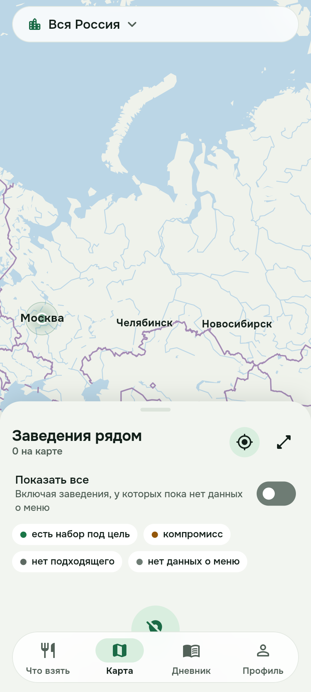 </p>

Рисунок 11 — Обзорная карта России и карта заведений в тёмной теме

## 3 Технологии и стек

Версии указаны точно по сборочным файлам: `server/build.gradle.kts`, `server/gradle/wrapper/gradle-wrapper.properties`, `app/pubspec.yaml`, `e2e/package.json`, `docker-compose.yml`, `.github/workflows/*.yml`. Где версия управляется BOM Spring Boot, это указано. Обоснования взяты из `docs/decisions.md`.

Таблица 16 — Стек сервера

| Компонент | Версия | Назначение и причина выбора |
|---|---|---|
| Kotlin (JVM) | 2.3.21 | Язык сервера; null-безопасность, data-классы, компактный код; `allWarningsAsErrors = true` |
| JDK | 21 (toolchain) | LTS-версия; виртуальные потоки (`spring.threads.virtual.enabled: true`) дают простой блокирующий код без WebFlux |
| Spring Boot | 4.1.1 | Каркас приложения; у 3.5 закончилась бесплатная поддержка, новые проекты начинаются на 4.1 |
| Spring Boot starters | по BOM 4.1.1 | webmvc, validation, jdbc, flyway, actuator, security, thymeleaf, cache |
| io.spring.dependency-management | 1.1.7 | Управление версиями зависимостей по BOM |
| Gradle Wrapper | 9.8.0 | Сборка |
| JdbcClient (Spring JDBC) | по BOM | Явный SQL: геозапросы PostGIS, массивы тегов, `ON CONFLICT` видны и проверяются планом |
| Flyway (+ flyway-database-postgresql) | по BOM | Версионные миграции схемы V1–V4 |
| springdoc-openapi-starter-webmvc-ui | 3.1.1 | Swagger UI и OpenAPI-описание API, снимок которого сверяется в тесте |
| Caffeine | по BOM | Кэш лучших наборов и окна лимитера в памяти; одного экземпляра сервера достаточно, Redis не нужен |
| Jackson 3 (tools.jackson, jackson-module-kotlin) | по BOM | Сериализация JSON |
| Apache Commons CSV | 1.14.1 | Разбор CSV меню и точек |
| AWS SDK for Java v2 (s3, url-connection-client) | BOM 2.55.9 | Работа с любым S3-совместимым хранилищем фото |
| tess4j | 5.4.0 | OCR Tesseract; версия подобрана под Leptonica 1.82 / Tesseract 5.3 из Ubuntu 24.04 (5.20 падала при загрузке) |
| Thymeleaf | по BOM | Серверные страницы админки: минимум кода, сессия и CSRF из коробки |
| Spring Security | по BOM | Форма входа админки, bcrypt, CORS для API |
| PostgreSQL JDBC | по BOM | Драйвер базы |

Таблица 17 — Стек клиента

| Компонент | Версия | Назначение и причина выбора |
|---|---|---|
| Flutter | 3.47.6 (CI) | Один код для Android, веба и iOS |
| Dart SDK | ^3.13.5 | Язык клиента; анализатор в режимах strict-casts, strict-inference, strict-raw-types |
| flutter_riverpod | 3.4.3 | Состояние и внедрение зависимостей; ViewModel на `Notifier`, подмена репозиториев фейками в тестах |
| go_router | 18.0.2 | Навигация, вкладки (`StatefulShellRoute`), редирект на онбординг |
| dio | 5.11.1 | HTTP-клиент; подмена адаптера для демо-режима без сервера |
| drift | 2.35.1 | Типизированная SQLite для профиля, дневника, настроек; в вебе — через WASM |
| drift_flutter | 0.3.1 | Открытие базы на устройстве и в браузере |
| freezed / freezed_annotation | 4.0.2 / 3.1.0 | Неизменяемые модели и sealed-состояния |
| json_serializable / json_annotation | 6.14.1 / 4.12.0 | Разбор JSON API |
| flutter_map | 8.3.2 | Карта с настраиваемым источником тайлов и собственными слоями |
| latlong2 | 0.10.1 | Координаты и расстояния |
| geolocator | 14.1.1 | Геолокация устройства |
| image_picker | 1.2.3 | Камера и галерея для фото меню |
| intl, flutter_localizations | 0.20.3, SDK | Даты и числа на русском, локализация gen-l10n |
| collection | 1.19.1 | Вспомогательные коллекции |
| build_runner, drift_dev | 2.16.1, 2.35.1 | Генерация кода |
| flutter_lints | 6.0.0 | Набор правил анализатора |
| Шрифты Onest и Unbounded | лицензия OFL, вложены в сборку | Хорошая кириллица, табличные цифры; приложение не обращается к CDN шрифтов |

Таблица 18 — Данные и инфраструктура

| Компонент | Версия | Назначение и причина выбора |
|---|---|---|
| PostgreSQL + PostGIS | образ `postgis/postgis:16-3.4` | Геопоиск в радиусе одной функцией с GiST-индексом; меню, модерация и точки — в одной транзакционной базе |
| SeaweedFS | образ `chrislusf/seaweedfs:3.97` | S3-совместимое хранилище фото меню (вместо MinIO) |
| Tesseract OCR | пакеты Ubuntu 24.04 `tesseract-ocr`, `-rus`, `-eng` | Бесплатное распознавание без передачи фото третьим лицам; языки `rus+eng` |
| Образ сервера | `eclipse-temurin:21-jre-noble` | JRE и Tesseract; запуск от непривилегированного пользователя `app` (uid 10001) |
| Docker Compose | — | База, хранилище, создание бакета и сервер одной командой; порты открыты только на 127.0.0.1 |
| Python | 3.12 (CI) | Скрипты подготовки данных `tool/` |
| osmium-tool; shapely; pyshp | пакет Ubuntu; 2.1.2; 2.3.1 | Нарезка выгрузки OSM, геометрия, чтение shapefile Natural Earth |

Таблица 19 — Средства тестирования и качества

| Компонент | Версия | Назначение |
|---|---|---|
| JUnit 5, AssertJ, spring-boot-starter-test | по BOM | Модульные и интеграционные тесты сервера |
| MockK | 1.14.11 | Подмены в Kotlin |
| jqwik | 1.10.1 | Проверка свойств алгоритма подбора на случайных меню |
| ArchUnit (archunit-junit5) | 1.5.1 | Проверка границ модулей |
| Testcontainers (+ spring-boot-testcontainers) | по BOM | PostGIS 16 и SeaweedFS в контейнерах для интеграционных тестов |
| ktlint (плагин) | 14.2.0 | Стиль кода Kotlin (ktlint_official) |
| detekt | 2.0.0-alpha.6 | Статический анализ Kotlin |
| Kover | 0.9.9 | Покрытие; пороги: строки 90%, ветки 80% |
| flutter_test | SDK | Юнит- и виджет-тесты клиента; порог покрытия строк 90% (`tool/check_coverage.dart`) |
| @playwright/test | 1.56.1 | Сквозные сценарии в Chromium |
| @axe-core/playwright | 4.10.2 | Проверка доступности админки по WCAG 2.2 AA |
| TypeScript, Prettier, @types/node | 5.9.3, 3.6.2, 22.18.8 | Типы и формат E2E-тестов |
| Node.js | 22 | Запуск Playwright |

Таблица 20 — Непрерывная интеграция (GitHub Actions)

| Workflow | Когда запускается | Задачи |
|---|---|---|
| `ci.yml` | push в `main`, каждый pull request | `server`: JDK 21, Tesseract, `./gradlew check koverXmlReport`; `app`: Flutter 3.47.6, `dart format`, генерация, `flutter analyze --fatal-infos`, тесты с порогом покрытия 90%; `android`: сборка APK `demo` и `store`; `e2e`: полный стек в Docker и Playwright; `dependency-review` (только PR): отказ при уязвимостях уровня high |
| `release.yml` | теги `v*`, push в `main` с изменениями клиента или сервера, ручной запуск | Тесты клиента, сборка двух APK варианта `demo` со встроенной картой (`TILE_URL_TEMPLATE=`): `norma-ryadom-demo.apk` (подключается к серверу) и `norma-ryadom-offline.apk` (`DEMO_SERVER=true`), публикация в Releases (для push — пререлиз «Демо-сборка N») |
| `basemap.yml` | push в `main` с изменениями `tool/basemap/` | Выгрузка OSM и Natural Earth, построение тайлов и списков заведений, публикация в ветку `basemap-data` |

Используемые действия: `actions/checkout@v5`, `actions/setup-java@v5`, `gradle/actions/setup-gradle@v5`, `subosito/flutter-action@v2`, `actions/setup-node@v5`, `actions/setup-python@v6`, `actions/upload-artifact@v4`, `actions/dependency-review-action@v4`, `softprops/action-gh-release@v2`; раннеры `ubuntu-24.04`. Отчёты тестов, покрытия и скриншоты E2E сохраняются как артефакты.
## 4 Архитектура

### 4.1 Общая схема

Комплекс состоит из мобильного клиента на Flutter, серверного монолита на Spring Boot, базы PostgreSQL с PostGIS и S3-совместимого хранилища фото (рисунок 12). Профиль, норма и дневник не покидают устройство: на сервер уходят только цель приёма пищи, теги исключения и координаты поиска, без идентификатора пользователя. Поэтому на сервере нет пользовательских объектов и, как следствие, нет поверхности для атак на чужие данные (IDOR); закрытая часть сервера — только админка. Подбор выполняется на сервере: меню и алгоритм находятся в одном месте, и улучшение алгоритма не требует выпуска новой версии клиента. Исключение — демо-режим, в котором тот же алгоритм перенесён в клиент.

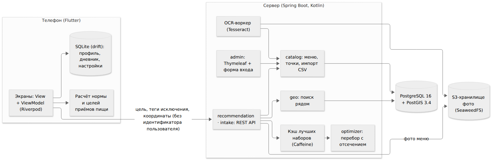

Рисунок 12 — Компоненты системы и потоки данных

Объём исходного кода: сервер — около 5,1 тыс. строк Kotlin в `server/src/main/kotlin`, клиент — около 13,5 тыс. строк Dart в `app/lib` без сгенерированных файлов.

### 4.2 Модули сервера

Сервер — монолит с модулями (раздел 9.2 документа идеи): один процесс и один деплой, модули — пакеты верхнего уровня `ru.normaryadom.*` с явными границами (таблица 21).

Таблица 21 — Модули сервера

| Модуль | Ответственность | Основные классы |
|---|---|---|
| `catalog` | Доменные модели каталога, импорт CSV, доступ к таблицам сетей, точек и блюд, загрузка демо-каталога | `Chain`, `Venue`, `MenuItem`, `MenuScope`, `DietTag`; `MenuCsvParser`, `VenueCsvParser`, `CsvEncoding`; `ChainRepository`, `VenueRepository`, `MenuItemRepository`; `CatalogImportService`, `MenuItemService`, `VenueMenuService`; `DemoCatalogLoader` |
| `geo` | Поиск точек в радиусе с расстоянием и признаком наличия меню | `NearbyVenueRepository`, `NearbyQuery`, `MenuCoverage` |
| `optimizer` | Чистый алгоритм подбора без Spring и SQL | `ComboOptimizer`, `ComboScorer`, `ComboDiversifier`, `MealStructure`, `MealTarget`, `ComboExplanation`, `ScoreWeights`, `PricePreference` |
| `recommendation` | Сценарии подбора у заведения и рядом, замена блюда, цвета точек карты, пометки блюд, кэш, REST API подбора и заведений | `ComboSearchService`, `VenueDirectoryService`, `DishAssessor`, `MenuComboCache`, `TargetRounding`; `ComboController`, `VenueController`, `RecommendationMapper` |
| `intake` | Фото меню (S3 + OCR), очередь модерации, жалобы на блюда, сообщения о закрытых точках | `MenuPhotoService`, `PhotoSanitizer`, `ModerationService`, `OcrWorker`, `MenuOcrProcessor`, `TesseractTextRecognizer`, `S3PhotoStorage`, `ItemReportService`, `ReporterFingerprint`, `VenueReportService`, `ReviewService`, `VenueReviewService` |
| `admin` | Веб-админка на Thymeleaf | `AdminController`, `AdminChainController`, `AdminModerationController`, `AdminReviewController`, `AdminVenueReviewController` |
| `web` | Единый формат ошибок API (Problem Details) | `ApiExceptionHandler`, `ProblemTypes`, `DietTagConverter` |
| `common` | Ограничение частоты, безопасность, время, общие исключения | `RateLimiter`, `ClientKey`, `SecurityConfiguration`, `AdminLoginRateLimitFilter`, `ClockConfiguration`, `NotFoundException` |

Границы модулей проверяет тест `ArchitectureTest` на ArchUnit (таблица 22). Нарушение любого правила роняет сборку.

Таблица 22 — Правила архитектуры (`server/src/test/kotlin/ru/normaryadom/architecture/ArchitectureTest.kt`)

| Правило (имя теста) | Что проверяется |
|---|---|
| алгоритм подбора не зависит от фреймворка, базы и веба | Классы `..optimizer..` не зависят от `org.springframework..`, `java.sql..`, `jakarta..`, `catalog.persistence..` |
| модули верхнего уровня не образуют циклов | Срезы `ru.normaryadom.(*)..` свободны от циклов |
| REST-контроллеры живут в пакетах api, а страницы админки — в admin | `@RestController` только в `..api..`, `@Controller` только в `..admin..` |
| контроллеры не обращаются к репозиториям напрямую | Классы с `@RestController` и `@Controller` не зависят от классов с `@Repository` |
| доменные модели каталога не зависят от слоёв приложения | `..catalog.domain..` не зависит от Spring, SQL, `persistence`, `api`, `web` |
| интеграции хранилища и распознавания не знают о веб-слое | `..intake.storage..` и `..intake.ocr..` не зависят от `api`, `web`, `admin` |

### 4.3 Слои клиента

Клиент построен по официальному руководству Flutter по архитектуре (рисунок 13). Каталог `app/lib/` разделён на слои:

- `domain` — модели (freezed + json_serializable), расчёт нормы (`NormCalculator`) и целей приёмов пищи (`MealPlanner`), справочник районов;
- `data` — репозитории (`ProfileRepository`, `DiaryRepository`, `SettingsRepository`, `VenueRepository`, `ComboRepository`, `FeedbackRepository`), сервисы (`NormaApi` на dio, `LocationService`, `PhotoPickerService`), локальная база drift, встроенный демо-сервер, загрузка карты; все зависимости объявлены провайдерами Riverpod в `data/providers.dart`;
- `ui/<экран>` — для каждого экрана View (виджеты) и ViewModel (Riverpod `Notifier`, `AsyncNotifier` или `FutureProvider`); общие виджеты и тема — в `ui/core`;
- `routing` — go_router: вкладки «Что взять», «Карта», «Дневник», «Профиль», экраны заведения и набора, редирект на онбординг при отсутствии профиля и на экран ошибки при повреждённой базе.

Поток данных однонаправленный: View вызывает действие ViewModel, ViewModel обращается к репозиторию и публикует новое состояние (sealed-классы `SearchIdle`, `SearchRunning`, `SearchDone`, `SearchFailed` и подобные), View перерисовывается. Ошибки передаются не исключениями, а значением `Result` (`Ok` или `Err` с `AppFailure`: нет связи, не найдено, неверный запрос, превышен лимит, неподдерживаемое фото, слишком большое фото, сервис недоступен, отказ в геолокации и другие).

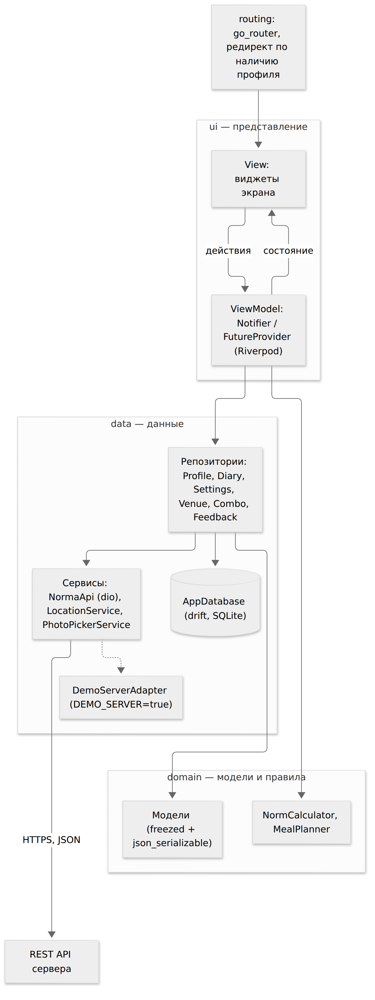

Рисунок 13 — Слои клиента и направления зависимостей

### 4.4 Путь запроса «Подобрать рядом»

Последовательность обработки показана на рисунке 14:

1. Клиент отправляет `POST /api/v1/combos/search` с целью, координатами и радиусом.
2. `ComboController` валидирует тело и вызывает `ComboSearchService.searchNearby`.
3. Сервис округляет цель внутрь окна пользователя (`TargetRounding`), чтобы похожие цели давали один ключ кэша.
4. `NearbyVenueRepository` возвращает до 100 активных точек с меню в радиусе, ближайшие первыми (запрос использует GiST-индекс, листинг 8).
5. Точки группируются по меню (`MenuScope`): от каждой сети остаётся ближайшая точка; точка с собственными блюдами образует отдельную группу.
6. Для каждой группы `MenuComboCache` возвращает пять лучших наборов; при промахе кэша их считает `ComboOptimizer`.
7. От каждой точки берутся два лучших набора, ранг набора = оценка + 0,5 × расстояние в километрах; возвращаются пять лучших по рангу.
8. `RecommendationMapper` формирует ответ с `appliedTarget`, суммами КБЖУ, проверками показателей и уровнем достоверности.

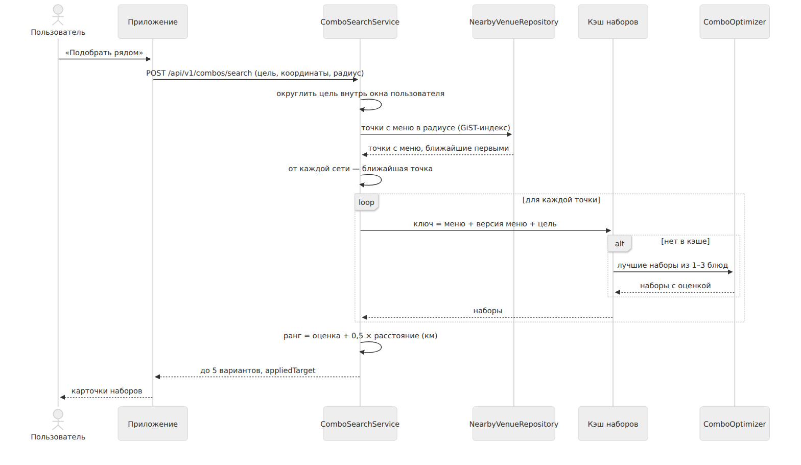

Рисунок 14 — Диаграмма последовательности «Подобрать рядом»

### 4.5 Жизненный цикл данных

Жизненный цикл блюда показан на рисунке 15. Блюдо появляется при импорте CSV сети (уровень A) или при модерации фото (уровень B). Жалобы трёх разных людей переводят его на перепроверку (`under_review`), и оно перестаёт участвовать в подборе. Модератор подтверждает, исправляет (уровень B) или снимает блюдо. Блюдо сети, которого нет в новом CSV, снимается (`is_available = FALSE`), а при появлении в следующем CSV возвращается. Каждое изменение повышает версию меню сети или точки, поэтому кэш наборов не отдаёт устаревший ответ.

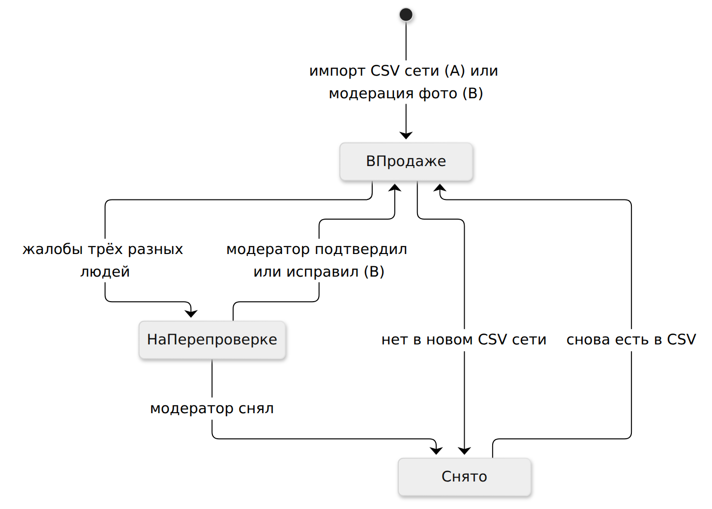

Рисунок 15 — Жизненный цикл данных о блюде

Аналогичный цикл есть у точки (рисунок 16): сообщения трёх разных людей переводят её на проверку и убирают из поиска и с карты; модератор либо возвращает точку и обновляет дату подтверждения, либо закрывает её. При закрытии модератором точка снимается с поиска (`is_active = FALSE`), а дата решения записывается в `closed_on`. Повторный импорт CSV точек или перезагрузка демо-каталога такую точку не возвращают: вернуть её может только источник, подтвердивший точку (`confirmed_on`) позже даты решения, — тогда `closed_on` очищается. Точка, которой просто нет в новом CSV, закрывается без даты решения и снова становится активной, когда появляется в следующем файле. Флаг проверки (`under_review`) повторный импорт не сбрасывает.

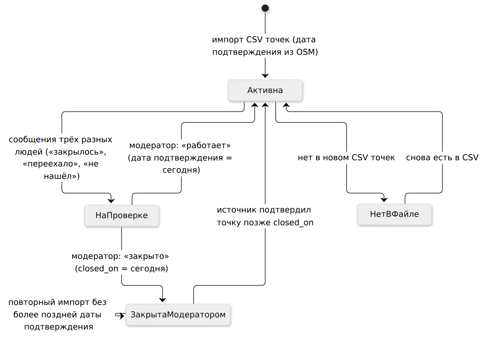

Рисунок 16 — Жизненный цикл точки

### 4.6 Развёртывание

`docker-compose.yml` описывает четыре сервиса: `db` (PostGIS, проверка готовности `pg_isready`), `storage` (SeaweedFS с S3-шлюзом, ключи доступа из переменных окружения), `storage-init` (однократно создаёт бакет `menu-photos`) и `server` (образ из `server/Dockerfile`, стартует после готовности базы и создания бакета). Образ сервера собирается из готового JAR (`./gradlew bootJar`), поэтому CI и E2E используют один и тот же проверенный артефакт. Порты базы (5432), хранилища (8333) и сервера (8080) открыты только на `127.0.0.1`; адрес сервера меняется переменной `SERVER_BIND`. Проверка живости контейнера сервера — `/actuator/health/liveness`.

## 5 База данных

### 5.1 Общие решения

Схема создаётся миграциями Flyway (`server/src/main/resources/db/migration`). Первичные ключи — `BIGINT GENERATED ALWAYS AS IDENTITY`, цены — целые копейки (`price_minor`), время — `timestamptz`, координаты — `GEOGRAPHY(POINT, 4326)`: расстояния считаются сразу в метрах без проекций. Меню хранится у сети, а не у каждой точки: одно меню на сотни точек не дублируется; у отдельной точки могут быть собственные блюда (уровень B). Ограничение `CHECK ((chain_id IS NULL) <> (venue_id IS NULL))` гарантирует ровно одного владельца блюда. Меню точки сети = меню сети + собственные блюда точки. Миграции V1–V4 начинаются с `SET LOCAL lock_timeout = '5s'`, чтобы не повиснуть на блокировке. ER-диаграмма — на рисунке 17.

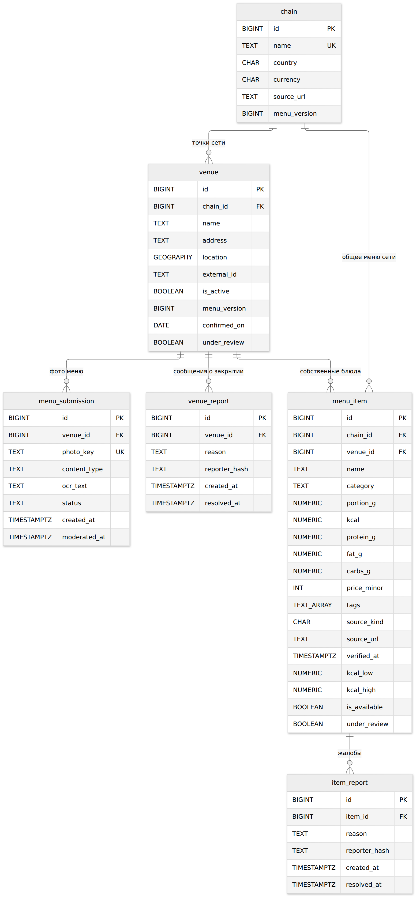

Рисунок 17 — ER-диаграмма базы данных

### 5.2 Таблицы

Таблица 23 — Сеть (`chain`)

| Колонка | Тип | Ограничения | Назначение |
|---|---|---|---|
| id | BIGINT | PK, identity | Идентификатор |
| name | TEXT | NOT NULL, UNIQUE, непустое | Название сети |
| country | CHAR(2) | NOT NULL, по умолчанию 'RU' | Страна (задел на расширение) |
| currency | CHAR(3) | NOT NULL, по умолчанию 'RUB' | Валюта цен |
| source_url | TEXT | — | Страница КБЖУ сети |
| menu_version | BIGINT | NOT NULL, по умолчанию 0 | Версия меню, часть ключа кэша |

Таблица 24 — Точка, заведение (`venue`)

| Колонка | Тип | Ограничения | Назначение |
|---|---|---|---|
| id | BIGINT | PK, identity | Идентификатор |
| chain_id | BIGINT | FK → chain(id), может быть NULL | Сеть; NULL у отдельного места |
| name | TEXT | NOT NULL, непустое | Название |
| address | TEXT | NOT NULL | Адрес |
| location | GEOGRAPHY(POINT, 4326) | NOT NULL | Координаты |
| external_id | TEXT | — | Внешний идентификатор (`osm-…`), ключ идемпотентного импорта |
| is_active | BOOLEAN | NOT NULL, по умолчанию TRUE | Точка работает |
| menu_version | BIGINT | NOT NULL, по умолчанию 0 | Версия собственного меню точки |
| confirmed_on | DATE | — (V3) | Дата последнего подтверждения |
| closed_on | DATE | — (V5) | Дата решения модератора «закрыто»; пока она задана, повторный импорт не возвращает точку |
| under_review | BOOLEAN | NOT NULL, по умолчанию FALSE (V3) | На проверке после сообщений о закрытии |

Таблица 25 — Блюдо (`menu_item`)

| Колонка | Тип | Ограничения | Назначение |
|---|---|---|---|
| id | BIGINT | PK, identity | Идентификатор |
| chain_id | BIGINT | FK → chain(id) | Владелец — сеть (общее меню) |
| venue_id | BIGINT | FK → venue(id) | Владелец — точка (собственное блюдо) |
| name | TEXT | NOT NULL, непустое | Название |
| category | TEXT | NOT NULL, CHECK in (main, side, salad, drink, dessert, sauce) | Категория |
| portion_g | NUMERIC(6,1) | > 0 | Порция, г |
| kcal | NUMERIC(6,1) | NOT NULL, ≥ 0 | Калории |
| protein_g, fat_g, carbs_g | NUMERIC(5,1) | NOT NULL, ≥ 0 | Белки, жиры, углеводы, г |
| price_minor | INT | ≥ 0 | Цена в копейках |
| tags | TEXT[] | NOT NULL, по умолчанию '{}' | Теги исключения |
| source_kind | CHAR(1) | NOT NULL, CHECK in (A, B, C) | Уровень достоверности |
| source_url | TEXT | — | Источник |
| verified_at | TIMESTAMPTZ | — | Дата проверки |
| kcal_low, kcal_high | NUMERIC(6,1) | обязательны тогда и только тогда, когда source_kind = 'C'; kcal_low ≤ kcal_high | Диапазон калорий для оценки |
| is_available | BOOLEAN | NOT NULL, по умолчанию TRUE | В продаже |
| under_review | BOOLEAN | NOT NULL, по умолчанию FALSE | На перепроверке после жалоб |

Таблица 26 — Заявка с фото меню (`menu_submission`)

| Колонка | Тип | Ограничения | Назначение |
|---|---|---|---|
| id | BIGINT | PK, identity | Номер заявки |
| venue_id | BIGINT | NOT NULL, FK → venue(id) | Заведение |
| photo_key | TEXT | NOT NULL, UNIQUE | Ключ объекта в S3 (`menu-photos/<точка>/<UUID>.<расширение>`) |
| content_type | TEXT | NOT NULL | `image/jpeg` или `image/png` |
| ocr_text | TEXT | — | Распознанный текст |
| status | TEXT | NOT NULL, по умолчанию 'NEW', CHECK in (NEW, OCR_DONE, OCR_FAILED, APPROVED, REJECTED) | Статус |
| created_at | TIMESTAMPTZ | NOT NULL, по умолчанию now() | Время загрузки |
| moderated_at | TIMESTAMPTZ | — | Время решения модератора |

Таблица 27 — Жалобы на блюда и сообщения о точках (`item_report`, `venue_report`)

| Колонка | Тип | Ограничения | Назначение |
|---|---|---|---|
| id | BIGINT | PK, identity | Идентификатор |
| item_id / venue_id | BIGINT | NOT NULL, FK → menu_item(id) / venue(id) | Объект жалобы |
| reason | TEXT | item_report: NOT NULL, непустое (до 500 символов по API); venue_report: CHECK in (closed, moved, not_found) | Причина |
| reporter_hash | TEXT | item_report: может быть NULL (добавлена в V2); venue_report: NOT NULL | HMAC-отпечаток адреса автора |
| created_at | TIMESTAMPTZ | NOT NULL, по умолчанию now() | Время |
| resolved_at | TIMESTAMPTZ | — | Время решения модератора; NULL — жалоба открыта |

### 5.3 Индексы

Таблица 28 — Индексы

| Индекс | Таблица и выражение | Назначение |
|---|---|---|
| `venue_location_gix` | GiST (location) | Геопоиск `ST_DWithin` по индексу |
| `venue_chain_idx` | venue (chain_id) | Точки сети |
| `venue_chain_external_uq` | UNIQUE venue (chain_id, external_id) WHERE external_id IS NOT NULL | Идемпотентный импорт точек сети |
| `venue_standalone_external_uq` (V4) | UNIQUE venue (external_id) WHERE chain_id IS NULL AND external_id IS NOT NULL | Идемпотентный импорт отдельных мест |
| `venue_under_review_idx` (V3) | venue (id) WHERE under_review | Очередь проверки точек |
| `chain.name` | UNIQUE | Одна сеть с данным названием |
| `menu_item_chain_idx`, `menu_item_venue_idx` | (chain_id) / (venue_id) WHERE is_available | Частичные индексы: снятые позиции не мешают выборке меню |
| `menu_item_tags_gin` | GIN (tags) | Поиск по тегам |
| `menu_item_chain_name_uq`, `menu_item_venue_name_uq` | UNIQUE (chain_id, name) / (venue_id, name) с условием на владельца | Идемпотентный импорт блюд |
| `menu_submission.photo_key` | UNIQUE | Один ключ фото — одна заявка |
| `menu_submission_venue_idx`, `menu_submission_status_idx` | (venue_id); (status, created_at) | Очередь распознавания и модерации |
| `item_report_item_idx`, `item_report_open_idx` | (item_id); (item_id) WHERE resolved_at IS NULL | Подсчёт открытых жалоб |
| `item_report_open_reporter_uq` (V2) | UNIQUE (item_id, reporter_hash) WHERE resolved_at IS NULL AND reporter_hash IS NOT NULL | Одна открытая жалоба на блюдо от одного человека |
| `venue_report_open_reporter_uq`, `venue_report_open_idx` (V3) | UNIQUE (venue_id, reporter_hash) WHERE resolved_at IS NULL; (venue_id) WHERE resolved_at IS NULL | Одно открытое сообщение о точке от одного человека; подсчёт |

Фильтр по исключённым тегам в текущей версии применяется в коде алгоритма (`MealTarget.allows`) после загрузки меню; GIN-индекс заложен схемой, но запросами по тегам пока не используется.

### 5.4 Миграции

Таблица 29 — Миграции Flyway

| Миграция | Что делает |
|---|---|
| `V1__catalog_and_intake.sql` | Включает расширение PostGIS; создаёт таблицы `chain`, `venue`, `menu_item`, `menu_submission`, `item_report` со всеми ограничениями `CHECK`, GiST-, GIN-, частичными и уникальными индексами |
| `V2__item_report_reporter.sql` | Добавляет колонку `item_report.reporter_hash` и частичный уникальный индекс открытых жалоб по автору (листинг 1) |
| `V3__venue_confirmation_and_reports.sql` | Добавляет `venue.confirmed_on` и `venue.under_review`, создаёт таблицу `venue_report` с уникальным индексом открытых сообщений по автору и индекс очереди проверки точек |
| `V4__standalone_venues.sql` | Добавляет уникальный индекс внешнего идентификатора для отдельных мест без сети |
| `V5__venue_closed_on.sql` | Добавляет колонку `venue.closed_on` — дату решения модератора о закрытии точки |

Листинг 1 — Миграция V2: отпечаток автора жалобы и уникальный индекс открытых жалоб

```sql
SET LOCAL lock_timeout = '5s';

ALTER TABLE item_report ADD COLUMN reporter_hash TEXT;

CREATE UNIQUE INDEX item_report_open_reporter_uq
    ON item_report (item_id, reporter_hash)
    WHERE resolved_at IS NULL AND reporter_hash IS NOT NULL;
```

### 5.5 Геозапрос

Запрос «точки рядом» (листинг 8) строит точку `ST_MakePoint(:lon, :lat)` — сначала долгота, потом широта, что проверяет отдельный тест «не путает широту и долготу», — приводит её к `geography` в системе координат 4326, отбирает точки функцией `ST_DWithin` (использует GiST-индекс) и сортирует по `ST_Distance`. Колонки точки и признаки наличия собственных блюд и блюд сети (`EXISTS`-подзапросы) берутся из общего фрагмента `VenueRows`. План запроса на 10 000 точек в радиусе 1 км сохранён в `docs/reports/explain-nearby-venues.txt`: `Bitmap Index Scan on venue_location_gix`, время выполнения 0,316 мс, без последовательного сканирования таблицы.

### 5.6 Идемпотентность и согласованность

- Импорт блюд и точек — это `INSERT … ON CONFLICT … DO UPDATE` по уникальным индексам (листинг 9): блюдо сети определяется парой (сеть, название), точка сети — парой (сеть, `external_id`), отдельное место — `external_id`. Повторный импорт того же файла не создаёт дублей, а обновляет значения. Блюда сети, которых нет в новом файле, снимаются с продажи (`withdrawChainItemsExcept`), точки — закрываются (`deactivateChainVenuesExcept`, `deactivateStandaloneExcept`). При повторном импорте дата подтверждения точки не стирается: `coalesce(EXCLUDED.confirmed_on, venue.confirmed_on)`. Точка, закрытая модератором (задан `closed_on`), при повторном импорте остаётся закрытой: `is_active = venue.closed_on IS NULL OR coalesce(EXCLUDED.confirmed_on > venue.closed_on, FALSE)`, а `closed_on` очищается, только если источник подтвердил точку позже решения модератора. Поэтому ни повторная загрузка CSV точек, ни перезагрузка демо-каталога не возвращают закрытую точку (два теста `VenueReportApiIT`).
- Импорт выполняется в одной транзакции: вставка, снятие пропавших позиций, обновление источника и повышение версии меню.
- Жалобы и сообщения о точках вставляются через `ON CONFLICT … DO NOTHING` по частичным уникальным индексам открытых жалоб: повторная жалоба того же человека не учитывается. Перед вставкой строка блюда или точки блокируется (`SELECT … FOR UPDATE`), поэтому параллельные жалобы не поднимут версию меню дважды (тест `ItemReportApiIT` с восемью параллельными жалобами).
- Версионирование меню: любое изменение блюда (импорт, перевод на перепроверку, подтверждение, исправление, снятие, добавление блюд точки) повышает `menu_version` владельца. Версия входит в ключ кэша лучших наборов (`MenuScope`), поэтому после изменения кэш не отдаёт устаревший ответ, а сбрасывать весь кэш не нужно.
- Модерация защищена от повторного решения: обновление статуса заявки выполняется с условием на открытый статус, а распознавание записывается только для заявки в статусе `NEW`.
- Повторная загрузка демо-каталога: `DemoCatalogLoader` пропускает сети, которые уже есть, и не загружает отдельные места повторно (раздел 2.6).

## 6 API

### 6.1 Эндпоинты

Публичный API имеет префикс `/api/v1`, принимает и отдаёт JSON (загрузка фото — `multipart/form-data`). Описание доступно в Swagger UI (`/swagger-ui.html`) и OpenAPI (`/v3/api-docs`); снимок описания хранится в `contract/openapi.json` и сверяется с сервером тестом `OpenApiContractIT`. Полный перечень — в таблице 30.

Таблица 30 — Эндпоинты сервера

| Метод и путь | Назначение | Основные поля | Ответы |
|---|---|---|---|
| GET `/api/v1/venues` | Заведения рядом с точкой; при переданной цели — цвет соответствия | `lat`, `lon`, `radius` (100–30 000 м), `includeWithoutMenu` (по умолчанию false), `limit` (1–500, по умолчанию 100), цель: `kcal`, `kcalTolerance`, `minProtein`, `maxFat`, `maxCarbs`, `excludeTags` (все пять числовых или ни одного) | 200 `venues[]`: `venue`, `distanceMeters`, `hasMenu`, `fit` (GOOD, COMPROMISE, NONE или null); 400 |
| GET `/api/v1/venues/{venueId}/menu` | Меню заведения; при переданной цели — отсортировано по близости к цели с пометками | `venueId`, параметры цели (необязательно) | 200 `venue`, `items[]` (КБЖУ, цена, теги, `source`, `assessment`); 400; 404 |
| POST `/api/v1/combos/search` | Подбор наборов в заведении или рядом с точкой | `target`, ровно одно из `venueId` и `location` (`lat`, `lon`, `radiusMeters` 100–5000), `preferCheaper`, `limit` (1–5, по умолчанию 5) | 200 `appliedTarget`, `options[]`; 400; 404 |
| POST `/api/v1/combos/replace` | Замена одного блюда, остальные зафиксированы | `venueId`, `target`, `dishIds` (1–3), `replaceIndex`, `preferCheaper`, `limit` | 200 как у поиска; 400; 404; 422 `dish-not-in-menu`, `dish-excluded` |
| POST `/api/v1/venues/{venueId}/menu-photos` | Загрузка фото меню в очередь распознавания и модерации | часть `photo` (JPEG или PNG, до 8 МБ, до 24 млн пикселей) | 202 `submissionId`, `status` = NEW; 404; 413; 415; 429; 503 |
| POST `/api/v1/items/{itemId}/reports` | Жалоба «цифры не совпадают» | `reason` (непустая, до 500 символов) | 204; 400; 404; 429 |
| POST `/api/v1/venues/{venueId}/reports` | Сообщение «заведение закрыто или переехало» | `reason`: `closed`, `moved`, `not_found` | 204; 400; 404; 429 |
| GET `/actuator/health`, `/actuator/info` | Проверка состояния (используется клиентом при проверке адреса сервера) | — | 200 |
| `/admin/**` | Веб-админка (раздел 1.12) | форма входа, CSRF | страницы HTML; без входа — перенаправление на `/admin/login` |

Цель приёма пищи (`MealTargetRequest`) валидируется: `kcal` 100–2000, `kcalTolerance` 10–500, `minProtein` 0–300, `maxFat` 0–300, `maxCarbs` 0–500, `excludeTags` — не больше 20 значений из списка тегов. Неизвестный тег — ошибка 400.

Таблица 31 — Структура ответа подбора (`ComboSearchResponse`)

| Поле | Содержимое |
|---|---|
| `appliedTarget` | Цель, по которой шёл поиск: `kcal`, `kcalTolerance`, `minProtein`, `maxFat`, `maxCarbs`, `excludeTags`. Для поиска рядом — округлённая, для поиска в заведении и замены — переданная |
| `options[].venue` | `id`, `name`, `chainName`, `address`, `lat`, `lon`, `currency`, `confirmedOn` |
| `options[].distanceMeters` | Расстояние в метрах; null при поиске в заведении |
| `options[].combo.dishes[]` | `id`, `name`, `category`, `portionGrams`, `nutrients`, `priceMinor`, `sourceKind`, `tags`; блюда упорядочены по категории |
| `options[].combo.totals` | Сумма `kcal`, `protein`, `fat`, `carbs` с точностью 0,1 |
| `options[].combo.priceMinor` | Сумма цен в копейках; null, если цена хотя бы одного блюда неизвестна |
| `options[].combo.sourceKind` | Худший уровень достоверности среди блюд |
| `options[].combo.score` | Оценка набора (меньше — лучше), 4 знака |
| `options[].combo.checks[]` | Для `KCAL`, `PROTEIN`, `FAT`, `CARBS`: `value`, `goal`, `delta`, `status` (`OK`, `ABOVE`, `BELOW`) |

Пример тела запроса подбора рядом для цели обеда из раздела 1.3 (координаты Москва-Сити, радиус по умолчанию клиента):

```json
{
  "target": {"kcal": 630, "kcalTolerance": 63, "minProtein": 27.7, "maxFat": 23.5, "maxCarbs": 94.5, "excludeTags": ["pork"]},
  "location": {"lat": 55.7495, "lon": 37.5374, "radiusMeters": 1500},
  "preferCheaper": false,
  "limit": 5
}
```

Для такой цели сервер вернёт `appliedTarget` = 630 ккал ± 60, белок от 30 г, жиры до 20 г, углеводы до 90 г (правила округления — раздел 7.5).

### 6.2 Ошибки: Problem Details (RFC 9457)

Все ошибки API возвращаются в формате Problem Details (`application/problem+json`) из единого обработчика `ApiExceptionHandler` (листинг 11). Поле `type` содержит машинный код ошибки вида `urn:norma-ryadom:problem:<код>`, `detail` — нейтральный текст на русском, для ошибок валидации — список `errors` из пар `field` и `message`, отсортированный по полю. Поле `type` позволяет различать ошибки с одинаковым статусом (например, два вида 422). Клиент в текущей версии сопоставляет ошибки по HTTP-статусу (`NormaApi.failureOf`: 400 и 422 — неверный запрос, 404 — не найдено, 413, 415, 429, 503 — свои сообщения, отсутствие ответа — нет связи) и показывает собственные локализованные тексты. Внутренности (SQL, имена классов, стек) не раскрываются: `server.error.include-stacktrace: never`, `include-message: never`, ошибки привязки параметров дают нейтральное «имеет неверное значение» (это проверяют `ApiErrorHandlingTest` и `VenueApiIT`).

Таблица 32 — Типы ошибок API (`ProblemTypes`)

| `type` (суффикс) | HTTP | Когда |
|---|---|---|
| `validation` | 400 | Нарушены ограничения полей, отсутствует или не читается тело, неполная цель, `replaceIndex` вне набора, не указано ровно одно из `venueId` и `location` |
| `not-found` | 404 | Нет заведения, блюда или заявки; в ответе `resource` и `resourceId` |
| `dish-not-in-menu` | 422 | Блюда из `dishIds` нет в меню заведения; в ответе `dishIds` |
| `dish-excluded` | 422 | В фиксированной части набора есть блюдо с исключённым тегом; в ответе `dishIds` |
| `rate-limit` | 429 | Превышен лимит частоты; заголовок `Retry-After` в секундах |
| `unsupported-photo` | 415 | Файл не JPEG и не PNG по сигнатуре или не читается |
| `photo-too-large` | 413 | Фото больше 8 МБ или 24 млн пикселей; тело запроса больше лимита multipart |
| `storage-unavailable` | 503 | Хранилище фото недоступно |
| `internal` | 500 | Непредвиденная ошибка (подробности — только в логе сервера) |

### 6.3 Ограничение частоты

Лимитер (`RateLimiter`, листинг 12) считает запросы в фиксированном окне для пары «корзина + ключ клиента» и хранит окна в Caffeine (до 100 000 клиентов). Ключ клиента (`ClientKey`) — IPv4-адрес целиком, а для IPv6 — сеть /64, иначе один клиент получил бы бесконечно много адресов. Лимиты хранятся в памяти процесса — этого достаточно для одного экземпляра сервера; при нескольких экземплярах их нужно вынести в Redis.

Таблица 33 — Лимиты частоты (`application.yml`, `rate-limit.buckets`)

| Корзина | Лимит | Что ограничивает |
|---|---|---|
| `menu-photo` | 5 за 10 минут | Загрузка фото меню |
| `item-report` | 20 за 1 час | Жалобы на блюда |
| `venue-report` | 10 за 1 час | Сообщения о закрытых точках |
| `admin-login` | 10 за 15 минут | Попытки входа в админку (при превышении — «Слишком много попыток») |

### 6.4 Приватность, CORS и доверенные прокси

- В запросах нет идентификатора пользователя, токенов и cookies; цепочка безопасности API без сессий (`STATELESS`) и без CSRF.
- Чтобы один человек не мог тремя жалобами снять блюдо или скрыть точку, сервер хранит не IP-адрес, а HMAC-SHA256 от ключа клиента с секретом `REPORTER_KEY` (`ReporterFingerprint`). По отпечатку адрес не восстановить, но повторная открытая жалоба того же человека отсекается уникальным индексом. Без `REPORTER_KEY` сервер не стартует.
- CORS разрешён только для `/api/**`, только с источников из `CORS_ALLOWED_ORIGINS`, методы GET и POST, заголовки `Content-Type` и `Accept`, кэш предварительного запроса 3600 с. Нужен для веб-сборки клиента.
- Заголовок `X-Forwarded-For` по умолчанию игнорируется: иначе любой клиент обходил бы лимиты подменой адреса. Он учитывается только от прокси, адреса которых соответствуют регулярному выражению `TRUSTED_PROXIES_REGEX` (`server.tomcat.remoteip.internal-proxies`). Тест `HttpEdgeIT` проверяет, что подмена заголовка не обходит лимит.
- Наружу из Actuator открыты только `health` и `info`; в профиле `prod` выключены Swagger и `api-docs`, логи пишутся в формате ECS JSON.
## 7 Алгоритм подбора

### 7.1 Постановка задачи

Дано меню заведения (в демо-каталоге — от 45 до 299 позиций), цель приёма пищи и предпочтение по цене. Нужно найти до пяти различных наборов из одного–трёх блюд, которые лучше всего попадают в цель. Это вариант задачи о рюкзаке с несколькими ограничениями. Алгоритм находится в модуле `optimizer` и не зависит от Spring и SQL (правило `ArchitectureTest`), что позволяет тестировать его модульными тестами, проверкой свойств и замером производительности.

Жёсткие ограничения (`MealTarget.isSatisfiedBy`, `MealTarget.allows`), с допуском сравнения 10⁻⁶:

- калории набора в окне [цель − допуск; цель + допуск];
- белок не меньше минимума; жиры и углеводы не больше максимума;
- ни одно блюдо не содержит исключённых тегов;
- одно и то же блюдо — не больше двух раз.

Правила состава приёма пищи (`MealStructure`, листинг 2) строже документа идеи: не больше одного основного блюда, одного напитка и одного соуса; соус допускается только вместе с основным блюдом, гарниром или салатом. Без правила про один соус алгоритм добирал калории соусами.

Листинг 2 — Правила состава приёма пищи

```kotlin
object MealStructure {
    const val MAX_SAME_DISH = 2

    private val categoryLimits =
        mapOf(
            DishCategory.MAIN to 1,
            DishCategory.DRINK to 1,
            DishCategory.SAUCE to 1,
        )

    private val sauceCarriers = setOf(DishCategory.MAIN, DishCategory.SIDE, DishCategory.SALAD)

    fun canAdd(
        picked: List<MenuItem>,
        candidate: MenuItem,
    ): Boolean {
        val categoryLimit = categoryLimits[candidate.category] ?: Int.MAX_VALUE
        return picked.count { it.category == candidate.category } < categoryLimit &&
            picked.count { it.id == candidate.id } < MAX_SAME_DISH
    }

    fun isComplete(dishes: List<MenuItem>): Boolean =
        dishes.none { it.category == DishCategory.SAUCE } || dishes.any { it.category in sauceCarriers }

    fun isValid(dishes: List<MenuItem>): Boolean =
        dishes.isNotEmpty() &&
            dishes.indices.all { index -> canAdd(dishes.subList(0, index), dishes[index]) } &&
            isComplete(dishes)
}
```

### 7.2 Целевая функция

Оценка набора (`ComboScorer.score`, листинг 3) — взвешенная сумма отклонений, меньше — лучше:

score = w_к · |К − К_ц| / Δ + w_б · Б_мин / (Б_мин + Б) + w_ж · Ж / Ж_макс + w_у · У / У_макс + штраф_доверия + штраф_цены,

где К, Б, Ж, У — суммы набора; К_ц и Δ — калории цели и допуск; Б_мин, Ж_макс, У_макс — пределы цели. Слагаемое белка убывает с ростом белка, слагаемые жиров и углеводов растут с их долей от предела. Если предел равен нулю, слагаемое не учитывается. Штраф доверия зависит от худшего уровня в наборе, штраф цены начисляется только при опции «подешевле»: w_цены · цена / 100 000 копеек (если цена хотя бы одного блюда неизвестна, считается 100 000 копеек, то есть полный штраф 0,5). Веса задаются в `application.yml` и проверяются при старте (таблица 34).

Таблица 34 — Веса целевой функции (`optimizer.weights`)

| Параметр | Значение | Смысл |
|---|---|---|
| `kcal` | 1,0 | Отклонение калорий в долях допуска |
| `protein` | 0,6 | Недобор белка |
| `fat` | 0,3 | Доля жиров от максимума |
| `carbs` | 0,1 | Доля углеводов от максимума |
| `trust-b` | 0,15 | Штраф за уровень B |
| `trust-c` | 0,6 | Штраф за уровень C (при равной близости C всегда ниже A и B) |
| `price` | 0,5 | Вес цены при «подешевле» |
| `price-scale-minor` | 100 000 | Масштаб цены, копеек |

Листинг 3 — Вычисление оценки набора

```kotlin
    fun score(
        totals: Nutrients,
        priceMinor: Int?,
        sourceKind: SourceKind,
        criteria: SearchCriteria,
    ): Double {
        val target = criteria.target
        val kcalTerm = abs(totals.kcal - target.kcal) / target.kcalTolerance
        val proteinTerm = shortfall(totals.protein, target.minProtein)
        val fatTerm = usage(totals.fat, target.maxFat)
        val carbsTerm = usage(totals.carbs, target.maxCarbs)
        return weights.kcal * kcalTerm +
            weights.protein * proteinTerm +
            weights.fat * fatTerm +
            weights.carbs * carbsTerm +
            weights.trustPenalty(sourceKind) +
            criteria.pricePreference.penalty(priceMinor, weights)
    }
```

### 7.3 Перебор с отсечением, куча и диверсификация

Число наборов ровно из трёх блюд с повторами при 200 позициях — C(202, 3) = 1 353 400. Перебор с отсечением даёт точный ответ, его легко объяснить и протестировать; целочисленный решатель для 1–3 блюд избыточен и упоминается как путь масштабирования (подбор из нескольких заведений, 4–5 блюд). Реализация (`ComboOptimizer`, листинг 7):

1. Из меню удаляются блюда с исключёнными тегами, остальные сортируются по калориям (при равенстве — по идентификатору).
2. Рекурсивный обход строит наборы как мультимножества: следующий индекс не меньше текущего, поэтому каждое сочетание рассматривается один раз, а повтор блюда возможен.
3. Отсечение: так как блюда отсортированы по возрастанию калорий, как только сумма с очередным блюдом превышает верхнюю границу калорий, цикл прерывается — все следующие блюда ещё калорийнее.
4. Блюдо добавляется, только если это разрешают правила состава (`MealStructure.canAdd`). Набор становится кандидатом, если он удовлетворяет всем ограничениям и полон (соус с носителем).
5. Кандидаты хранятся в куче фиксированной ёмкости limit × 4 (`heap-factor: 4`), упорядоченной так, что на вершине худший из лучших; новый кандидат вытесняет вершину, если он лучше. Порядок наборов полностью детерминирован: по оценке, затем лексикографически по идентификаторам блюд.
6. Диверсификация (`ComboDiversifier`): из отсортированных кандидатов жадно берутся наборы, у которых с каждым уже выбранным не больше одного общего блюда (с учётом повторов). Поэтому среди показанных вариантов нет пяти наборов «бургер + разные напитки».

Точка входа алгоритма показана в листинге 4, рекурсивный обход и куча — в листинге 7 (раздел 11).

Листинг 4 — Точка входа подбора: фильтр, сортировка, перебор, диверсификация

```kotlin
    fun bestCombos(
        menu: List<MenuItem>,
        criteria: SearchCriteria,
        limit: Int,
    ): List<Combo> {
        val allowed =
            menu
                .filter(criteria.target::allows)
                .sortedWith(compareBy<MenuItem>({ it.nutrients.kcal }, { it.id }))
        val best = BoundedBest(limit * settings.heapFactor)
        Enumeration(allowed, criteria, best).run()
        return ComboDiversifier.diversify(best.ranked(), limit)
    }
```

Корректность отсечения доказана проверкой свойств: на 200 случайных меню из 30 блюд результат совпадает с полным перебором без отсечений. Ещё три свойства по 300 случайных меню проверяют, что каждый набор удовлетворяет ограничениям, не содержит исключённых тегов, а результаты отсортированы и попарно имеют не больше одного общего блюда.

### 7.4 Замена блюда

`ComboOptimizer.replacements` перебирает все допустимые блюда меню, кроме заменяемого, подставляет каждое на позицию заменяемого, отбрасывает наборы, нарушающие правила состава или ограничения цели, и возвращает лучшие по оценке. Остальные блюда фиксированы. Сервис заранее проверяет, что все блюда набора есть в меню (иначе 422 `dish-not-in-menu`) и что фиксированные блюда не содержат исключённых тегов (иначе 422 `dish-excluded`); это закрыло дефект, когда замена оставляла в наборе блюдо с исключённым продуктом. Клиент передаёт цель из `appliedTarget` поиска, поэтому набор и замены оцениваются по одной цели.

### 7.5 Округление цели и ослабление ограничений

Чтобы похожие цели разных пользователей давали один ключ кэша, при поиске рядом и для цветов карты цель округляется «внутрь» окна пользователя (`TargetRounding`, листинг 10): калории — до ближайших 10 ккал (не меньше 10); допуск — уменьшается на величину сдвига калорий и округляется вниз до 5 (не меньше 5); минимум белка — вверх до 5 г; максимумы жиров и углеводов — вниз до 5 г. Поэтому найденный набор всегда укладывается в исходную цель пользователя; это проверяет свойство «округлённая цель не шире исходной» на 500 случайных целях. Например, цель 630 ± 63 ккал, белок ≥ 27,7 г, жиры ≤ 23,5 г, углеводы ≤ 94,5 г округляется до 630 ± 60, белок ≥ 30, жиры ≤ 20, углеводы ≤ 90.

Для цвета точки на карте используются два варианта цели (`VenueDirectoryService`): строгая (округлённая) и ослабленная (`optimizer.relaxation`: допуск калорий × 2, минимум белка × 0,8, максимумы жиров и углеводов × 1,2).

Таблица 35 — Уровни соответствия заведения цели (`FitLevel`)

| Уровень | Условие | Цвет на карте |
|---|---|---|
| `GOOD` | Есть хотя бы один набор под строгую цель | зелёный, «есть набор под цель» |
| `COMPROMISE` | Под строгую цель наборов нет, под ослабленную есть | жёлтый, «компромисс» |
| `NONE` | Наборов нет даже под ослабленную цель | серый, «нет подходящего» |
| null | У заведения нет данных о меню | серый, «нет данных о меню» |

### 7.6 Учёт расстояния

При поиске рядом (`ComboSearchService.searchNearby`) запрашиваются до 100 ближайших точек с меню (`nearby.max-results`). От каждой группы с одинаковым меню остаётся ближайшая точка, от каждой точки берутся два лучших набора (`nearby.combos-per-venue`), и наборы ранжируются по величине «оценка + 0,5 × расстояние в километрах» (`nearby.distance-weight-per-km`). Набор с оценкой хуже меньше чем на 0,25 может оказаться выше, если заведение ближе на 500 м. В ответ попадают до `limit` (по умолчанию 5) лучших вариантов.

### 7.7 Кэш

`MenuComboCache.bestCombos` помечен `@Cacheable("bestCombos")`; кэш Caffeine ограничен 20 000 записей со сроком жизни 1 час после записи. Ключ — пара (`MenuScope`, `SearchCriteria`): меню (сеть и/или точка) вместе с их версиями и округлённая цель с предпочтением по цене. Для каждого ключа хранятся пять лучших наборов. Подбор для сети выполняется один раз на ключ, а версия меню в ключе исключает устаревший ответ после импорта, жалоб или модерации без сброса всего кэша. Подбор в одном заведении («Собрать обед здесь») и замена блюда идут по точной цели пользователя и кэш не используют. Интеграционный тест выявил, что сначала кэш фактически не работал из-за отсутствия `@EnableCaching`; добавлена `CachingConfiguration`, тест проверяет наполнение кэша и сброс по версии меню.

### 7.8 Производительность

Замер выполняет `ComboOptimizerPerformanceTest`: по 5 случайных меню каждого размера, 9 замеров после прогрева, бюджет — 100 мс на меню из 250 позиций; данные — `docs/reports/optimizer-timing.csv` (таблица 36, рисунок 18).

Таблица 36 — Время подбора в зависимости от размера меню

| Позиций в меню | 25 | 50 | 100 | 150 | 200 | 250 |
|---|---|---|---|---|---|---|
| Медиана, мс | 0,08 | 0,24 | 0,47 | 1,32 | 4,11 | 5,99 |
| 90-й перцентиль, мс | 0,13 | 0,34 | 0,68 | 2,15 | 4,70 | 10,17 |

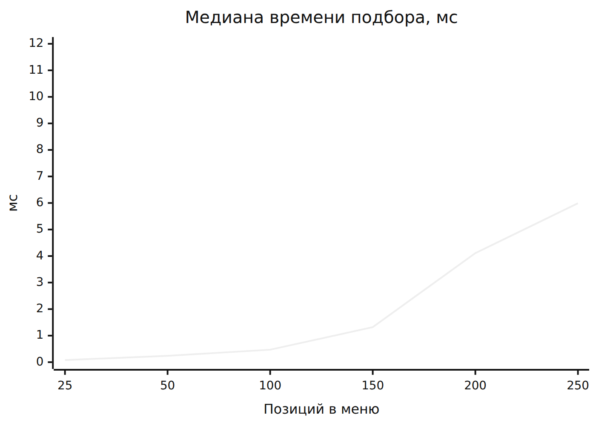

Рисунок 18 — Медиана времени подбора, мс

Рост сверхлинейный (число сочетаний до трёх блюд растёт как n³), но отсечение по калориям и куча фиксированного размера держат меню из 250 позиций на порядок ниже бюджета.

## 8 Клиент

### 8.1 Экраны и управление состоянием

Таблица 37 — Экраны клиента

| Маршрут | Экран | Состояние (Riverpod) |
|---|---|---|
| `/onboarding` | Онбординг из трёх шагов | `onboardingProvider` (`OnboardingController`), `normPreviewProvider` |
| `/home` (вкладка «Что взять») | Остаток на сегодня, приём пищи, цель, подбор рядом | `daySummaryProvider`, `mealSelectionProvider`, `currentTargetProvider`, `nearbySearchProvider` (`NearbySearchController`) |
| `/combo` | Набор, проверки показателей, замена, запись в дневник | `selectedComboProvider`, `replacementProvider` (`ReplacementController`), `diaryActionsProvider` |
| `/map` (вкладка «Карта») | Карта, кластеры, шторка списка, легенда | `mapVenuesProvider`, `mapViewportProvider`, `mapCoverageProvider`, `mapAtlasProvider`, `packStoreProvider` |
| `/venue/:id` | Заведение: меню с пометками, наборы, жалобы, фото | `venueMenuProvider`, `venueComboProvider` (`VenueComboController`), `feedbackActionsProvider` |
| `/diary` (вкладка «Дневник») | Приёмы пищи за день, прогресс, быстрое добавление | `todayProvider`, `quickAddProvider`, `diaryActionsProvider` |
| `/profile`, `/profile/edit` (вкладка «Профиль») | Профиль, норма, предпочтения, район, сервер, удаление данных | `profileProvider` (`ProfileController`), `locationProvider`, `serverSettingsProvider` |
| `/data-error` | Повреждённая локальная база: «повторить / сбросить данные» | `profileProvider` |

Общие провайдеры сессии (`ui/core/session.dart`): профиль, эффективная норма, текущий день (обновляется при возвращении приложения из фона), выбор приёма пищи (по умолчанию по времени суток), текущая цель, разрешённое местоположение (устройство или центр района) и сводка дня. Действия, выполняемые после `await`, проверяют `ref.mounted` и получают зависимости явно: E2E выявил, что загрузка фото обрывалась молча, когда действие обращалось к автоудаляемому провайдеру после `await`. Пример ViewModel — листинг 14.

### 8.2 Сетевой слой

`NormaApi` (`app/lib/data/services/norma_api.dart`) — тонкая обёртка над dio: таймауты соединения 5 с, ответа 15 с, отправки 30 с; ответы разбираются моделями freezed, перечисления переживают неизвестные значения. Тест `norma_api_test.dart` проверяет точный состав отправляемых полей — в запросах нет ничего, кроме цели, координат и параметров поиска. Адрес сервера хранится в локальных настройках и проверяется запросом `/actuator/health` перед сохранением; сборка `store` принимает только `https://` (кроме локальных адресов).

### 8.3 Локальная база данных

Профиль, дневник и настройки хранятся в SQLite через drift (`app/lib/data/local/app_database.dart`, листинг 15); в веб-сборке — SQLite в WASM (`web/sqlite3.wasm`, `web/drift_worker.js`).

Таблица 38 — Таблицы локальной базы

| Таблица | Колонки | Назначение |
|---|---|---|
| `ProfileRecords` | `id` (PK), `json` | Профиль пользователя в JSON (параметры, предпочтения, ручная норма, согласие на геолокацию, район) |
| `DiaryRecords` | `id` (автоинкремент), `day`, `meal`, `title`, `venueName`, `kcal`, `protein`, `fat`, `carbs`, `createdAt`, `favorite` | Записи дневника |
| `SettingRecords` | `key` (PK), `value` | Настройки, например адрес сервера (добавлена в версии схемы 2) |

Версия схемы — 2; миграция с версии 1 создаёт таблицу настроек. При открытии базы включается `PRAGMA secure_delete = ON`, а удаление всех данных выполняется в транзакции с последующим `VACUUM`, чтобы удалённое не оставалось в файле базы (листинг 5).

Листинг 5 — Версия схемы, миграция и удаление всех данных

```dart
  @override
  int get schemaVersion => 2;

  @override
  MigrationStrategy get migration => MigrationStrategy(
    onUpgrade: (migrator, from, to) async {
      if (from < 2) await migrator.createTable(settingRecords);
    },
    beforeOpen: (_) => customStatement('PRAGMA secure_delete = ON'),
  );

  Future<void> deleteEverything() async {
    await transaction(() async {
      await delete(diaryRecords).go();
      await delete(profileRecords).go();
    });
    await customStatement('VACUUM');
  }
```

### 8.4 Локализация

Все тексты интерфейса находятся в `app/lib/l10n/app_ru.arb` (296 строк) и генерируются в класс `AppLocalizations` инструментом gen-l10n (`l10n.yaml`, каталог `lib/l10n/generated`). Язык приложения фиксирован — русский. Тексты админки находятся в шаблонах Thymeleaf и `server/src/main/resources/messages.properties`.

### 8.5 Встроенная векторная карта

Подложка рисуется собственными слоями `flutter_map` (`ui/map/vector_basemap.dart`, `basemap_layers.dart`) из данных `app/assets/map/`: `country.json`, `index.json` (регионы, станции метро, подписи городов) и пачки тайлов `packs/overview`, `packs/suburb`, `packs/city`. `AssetStore` хранит до 24 пачек с вытеснением, запоминает неудачную загрузку (иначе сломанная пачка перезагружалась бы по кругу) и разбирает JSON вне UI-потока. Слои каждого тайла кэшируются под своим ключом, на широком окне обрабатывается до 256 тайлов. Мелкие дороги появляются с 14-го масштаба. Подписи городов и метро учитывают системный размер шрифта и не накладываются на точки. Если задан `TILE_URL_TEMPLATE`, вместо подложки используется растровый `TileLayer`.

### 8.6 Демо-сервер и проверка эквивалентности

`DemoServerAdapter` реализует интерфейс `HttpClientAdapter` dio и обрабатывает те же маршруты, что и сервер: `/actuator/health`, `GET /api/v1/venues`, `GET /api/v1/venues/{id}/menu`, `POST /api/v1/combos/search`, `POST /api/v1/combos/replace`, загрузку фото, жалобы и сообщения о закрытии. `demo_engine.dart` повторяет серверные правила: округление цели, правила состава, оценку, перебор с отсечением и кучей limit × 4, диверсификацию, пометки блюд, объяснение показателей, уровни соответствия; от каждой сети при поиске рядом берётся ближайшая точка, как на сервере.

Эквивалентность проверяется контрактом. Серверный тест `DemoComboContractTest` прогоняет настоящий `ComboOptimizer` и `DishAssessor` на CSV трёх сетей с официальными КБЖУ для пяти сценариев («обед без свинины», «обед без свинины подешевле», «завтрак», «вегетарианский ужин», «перекус») и записывает в `contract/combo-cases.json` округлённую цель, уровень соответствия, наборы рядом, наборы в заведении, замены первого блюда и пометки всех блюд. Тест падает, если результат расходится с сохранённым эталоном. Клиентский тест `test/data/demo/demo_contract_test.dart` загружает тот же эталон и проверяет, что демо-движок выдаёт те же ответы (5 сценариев × 3 сети). Аналогично `contract/norm-cases.json` связывает расчёт нормы на клиенте и на сервере.

### 8.7 Доступность, тема и дизайн

- Тема — светлая и тёмная по системной настройке; цвета КБЖУ, статусов и карты заданы один раз токенами `Palette` (`ui/core/theme.dart`). Мягкие статусы вместо красного «нельзя»: приложение про еду не должно ругать.
- Шрифты Onest (текст) и Unbounded (заголовки, крупные числа) вложены в сборку; цифры табличные. Веб-сборка собирается с `--no-web-resources-cdn` и не ходит в CDN.
- Доступность проверяется виджет-тестами `accessibility_test.dart`: размер целей нажатия, подписи и контраст (`meetsGuideline`), озвучивание КБЖУ словами, уровень соответствия на карте словами, работа при шрифте ×2, у каждой точки и кластера на карте свой узел доступности. Анимации выключаются при системной настройке «уменьшить движение».
- Аудит вёрстки (`layout_audit_test.dart`) проверяет все экраны при ширине 320, 375 и 412 dp и шрифте ×1,3: наложение текстов, отступ от края не меньше 12 dp, зазор между подписями не меньше 4 dp, переполнения.
- Админка проверяется axe-core на соответствие WCAG 2.2 AA (5 страниц, 0 нарушений).

### 8.8 Платформы

- Android: варианты `demo` (суффикс идентификатора `.demo`, разрешён HTTP к любому адресу) и `store` (HTTP только к `127.0.0.1`, `localhost`, `10.0.2.2`); `allowBackup=false` и запрет облачного бэкапа и переноса данных (`data_extraction_rules.xml`), так как профиль и дневник — данные о здоровье. Релизная сборка подписывается отладочным ключом, поэтому каждая сборка из Releases ставится только после удаления предыдущей.
- Веб: собирается `flutter build web`; используется в E2E и для демо-версии без сервера.
- iOS: проект Xcode сгенерирован Flutter, в `Info.plist` есть описания доступа к геолокации, камере и фото и разрешение HTTP только для локальной сети (`NSAllowsLocalNetworking`). README описывает запуск на iOS-симуляторе (нужны macOS и Xcode). Сборка для iOS в CI не настроена, подписи и публикации для реальных устройств нет; для проверки на iPhone предлагается веб-демо (раздел 12.5).

## 9 Безопасность и приватность

Таблица 39 — Угрозы и меры защиты

| Угроза или требование | Мера | Где реализовано или проверено |
|---|---|---|
| Персональные и чувствительные данные (рост, вес, предпочтения — данные о здоровье и убеждениях, ст. 10 152-ФЗ) | Профиль, норма и дневник только на устройстве; предпочтения сформулированы как пищевые, без вопросов о религии и болезнях; на сервер уходят цель, теги и координаты без идентификатора | `norma_api_test.dart` (точный состав полей), `local_repositories_test.dart` |
| Утечка данных из резервных копий | Android: `allowBackup=false`, исключение из облачного бэкапа и переноса | Манифест, `data_extraction_rules.xml` |
| Восстановление удалённых данных из файла базы | `PRAGMA secure_delete`, `VACUUM` после удаления | `local_repositories_test.dart` |
| Подбор пароля админки | bcrypt-хеш из окружения, без хеша сервер не стартует; 10 попыток за 15 минут | `AdminWebIT`, `ConfigurationValidationTest` |
| CSRF в админке | Форма входа Spring Security, CSRF-токен во всех изменяющих запросах | `AdminWebIT` |
| Накрутка жалоб одним человеком | HMAC-отпечаток адреса, уникальный индекс открытых жалоб, блокировка строки, порог три человека | `ItemReportApiIT`, `VenueReportApiIT` |
| Обход лимитов подменой `X-Forwarded-For` | Заголовок учитывается только от доверенных прокси | `HttpEdgeIT` |
| Множество IPv6-адресов у одного клиента | Ключ лимита — сеть /64 | `ClientKeyTest` |
| Вредоносные или огромные файлы | До 8 МБ и 24 млн пикселей, размер в пикселях проверяется по заголовку до распаковки, тип — по сигнатуре файла, а не по заявленному `Content-Type` | `MenuPhotoApiIT`, `PhotoFormatTest` |
| Геометка в фото | Фото перекодируется без метаданных (EXIF) | `MenuPhotoApiIT` |
| Подмена типа содержимого при показе модератору | `X-Content-Type-Options: nosniff` | `AdminModerationController` |
| Раскрытие внутренностей в ошибках | Problem Details с нейтральными текстами, без стека и сообщений исключений | `ApiErrorHandlingTest`, `VenueApiIT` |
| Лишние персональные данные в логах | В логах только идентификаторы (заявка, заведение, блюдо); IP и тексты жалоб не логируются | Ревью кода |
| Доступ к служебным эндпоинтам | Actuator — только `health` и `info`; в `prod` выключены Swagger и `api-docs`; всё, что не разрешено явно, запрещено (`denyAll`) | `SecurityConfiguration` |
| Доступ к базе и хранилищу извне | Порты Docker только на 127.0.0.1; сервер в контейнере от непривилегированного пользователя | `docker-compose.yml`, `Dockerfile` |
| Неверная конфигурация | Свойства с `@Validated`: без ключей хранилища, `REPORTER_KEY`, хеша пароля или с неверными лимитами сервер не стартует | `ConfigurationValidationTest` (8 тестов) |
| Уязвимые зависимости | `dependency-review-action` в каждом PR, отказ при уровне high; точные версии зависимостей | CI |
| Безопасность пользователя (расстройства пищевого поведения) | Безопасный минимум 1200/1500 ккал, дефицит не больше 20%, нейтральные формулировки, дисклеймер | `norm_calculator_test.dart`, `onboarding_test.dart` |
| Передача фото третьим лицам | OCR на своём сервере (Tesseract), а не в облачном сервисе | — |
## 10 Тестирование

### 10.1 Пирамида тестов

Все проверки воспроизводятся командами из README и выполняются в CI на каждый push в `main` и каждый pull request. По `docs/testing.md` последний прогон на `main` зелёный по всем задачам (сервер, клиент, E2E). Итоги приведены в таблице 40.

Таблица 40 — Итоги проверок (`docs/testing.md`)

| Уровень | Что проверяется | Объём | Результат |
|---|---|---|---|
| Сервер: модульные тесты | Алгоритм подбора, оценка, состав приёма пищи, CSV-парсеры, округление цели, пометки блюд, лимитер, ключ клиента (IPv4/IPv6), формат фото | 76 | зелёные |
| Сервер: проверка свойств (jqwik) | Ограничения, теги, сортировка, совпадение с полным перебором; округлённая цель не шире исходной | 5 свойств × 200–500 случайных входов | зелёные |
| Сервер: производительность | Подбор на меню 25–250 позиций, бюджет 100 мс | 2 | на 250 позициях медиана 6 мс, 90-й перцентиль 10 мс |
| Сервер: интеграционные (Testcontainers: PostGIS 16 + SeaweedFS, реальный Tesseract) | Импорт (кодировка, закрытие точек), геопоиск и план запроса, API, загрузка фото (EXIF, «бомба» по пикселям, битый файл), OCR с пропавшим фото, жалобы (дубли, параллельные, кэш), закрытая модератором точка при повторной загрузке, замена с исключённым продуктом, админка (блокировка входа), контракт OpenAPI, демо-каталог | 67 | зелёные |
| Сервер: настоящий HTTP (Tomcat на случайном порту) | Лимит multipart → Problem Details 413; подмена `X-Forwarded-For` не обходит лимит частоты | 2 | зелёные |
| Сервер: архитектура (ArchUnit) | Алгоритм без фреймворка, нет циклов, контроллеры не ходят в репозитории | 6 | зелёные |
| Сервер: контракт демо-режима | Подбор, замены, цвета точек и пометки на демо-каталоге записываются в `contract/combo-cases.json` | 1 | зелёный |
| Сервер: конфигурация | Без хеша пароля, ключей хранилища, ключа обезличивания или с неверными лимитами сервер не стартует | 8 | зелёные |
| Сервер: всего | | 167 тестов | покрытие строк 98,7%, веток 85,5% (пороги 90% и 80%) |
| Сервер: статический анализ | ktlint (ktlint_official), detekt, `allWarningsAsErrors` | — | 0 замечаний |
| Клиент: юнит-тесты | Норма по общим контрольным примерам, цели приёмов пищи, HTTP-клиент, SQLite-репозитории и миграция, проверка адреса сервера, безопасность ручной нормы, демо-сервер и его совпадение с серверным подбором (5 сценариев × 3 сети), значки блюд, атлас карты, хранилище пачек с вытеснением, полигоны с дырами, расстояние и время пешком, границы регионов | 72 | зелёные |
| Клиент: виджет-тесты | Аудит вёрстки всех экранов (320/375/412 dp, шрифт ×1,3), кластеры, подгрузка видимой области, переход между городами, карта России, список на весь экран, выбор района, онбординг, главный экран (гонка поиска), набор и замена, заведение, дневник, профиль, двойные нажатия, отказ в доступе к фото, повреждённые данные, смена дня, смена сервера, демо-режим, доступность | 93 | зелёные |
| Клиент: всего | | 165 тестов | покрытие строк 96,7% (порог 90%) |
| Android | Сборки `demo` и `store` в CI, демо-APK в Releases | 2 сборки | собираются |
| Клиент: статический анализ | `flutter analyze --fatal-infos` (strict-режимы), `dart format` | — | 0 замечаний |
| E2E (Playwright, Chromium) | Весь стек в Docker, веб-сборка приложения и админка прокликиваются как пользователем | 5 сценариев | зелёные |
| E2E: доступность админки | axe-core, WCAG 2.2 AA | 5 страниц | 0 нарушений |

### 10.2 Виды тестов и соглашения

- Имена тестов — русская фраза в третьем лице («подбирает…», «не даёт…»), одно правило на тест.
- Модульные тесты сервера проверяют чистый Kotlin без Spring: `ComboOptimizerTest`, `ComboScorerTest`, `MealRulesTest`, `DishAssessorTest`, `TargetRoundingTest`, `MenuCsvParserTest`, `VenueCsvParserTest`, `RateLimiterTest`, `ClientKeyTest`, `PhotoFormatTest`.
- Интеграционные тесты наследуют `IntegrationTest`: поднимаются контейнеры `postgis/postgis:16-3.4` и SeaweedFS, данные готовятся через `CatalogFixtures`; OCR-тесты используют установленный Tesseract с русским языком. План геозапроса проверяется на 10 000 точек (`NearbyVenueRepositoryIT`).
- Контрактные тесты: `OpenApiContractIT` сверяет OpenAPI с `contract/openapi.json`; `NormCalculationContractTest` и клиентский `norm_calculator_test.dart` — расчёт нормы по `contract/norm-cases.json`; `DemoComboContractTest` и `demo_contract_test.dart` — демо-режим по `contract/combo-cases.json`. Эталоны обновляются осознанно флагом `-PupdateContract=true`.
- Виджет-тесты клиента запускают приложение через `TestHarness` (`app/test/support/pump_app.dart`) с фейками репозиториев и сервисов из `test/support/fakes.dart` и фиксированным временем (листинг 16).
- Сквозные тесты (`e2e/tests/`) работают с веб-сборкой Flutter через дерево доступности (`flt-semantics`): поиск по ролям и подписям, ввод с ожиданием фокуса (листинг 17).

### 10.3 Сквозные сценарии

Скрипт `scripts/e2e.sh` генерирует случайные секреты, хеширует пароль админки (`htpasswd`), собирает JAR сервера, поднимает `docker compose` с профилем `demo`, собирает веб-версию клиента с пустым `TILE_URL_TEMPLATE`, раздаёт её на порту 8090 и запускает Playwright. Стенд имитирует обратный прокси: `TRUSTED_PROXIES_REGEX` разрешает `X-Forwarded-For` только из сетей Docker. При падении скрипт печатает логи контейнеров.

1. Сценарий защиты (`app.demo-scenario.spec.ts`, окно 412 × 915, геолокация Москва-Сити): онбординг 25 лет / 165 см / 62 кг / умеренная активность / похудение → норма 1800 ккал и «Белки 99 г · Жиры 56 г · Углеводы 225 г» → «Без свинины» → геолокация → обед ≈ 630 ккал ± 63 → «Подобрать рядом» (не меньше трёх вариантов, ни одного со свининой, ветчиной, пепперони, карбонарой) → набор с отклонениями → замена блюда с пересчётом → «Записать в дневник» → остаток уменьшился → карта с легендой → «Бургер Кинг» → значки «данные сети · проверено» и пометки → «Собрать обед здесь» → жалоба «Цифры не совпадают» → загрузка фото меню из галереи → профиль.
2. Админка (`admin.moderation.spec.ts`, четыре теста): без входа админка недоступна и неверный пароль отклоняется; создание сети, ошибки CSV построчно, импорт меню и точек; фото меню проходит OCR в контейнере, модератор переносит блюда, они появляются в API с уровнем B; повторная жалоба того же человека не считается, жалобы трёх разных людей убирают блюдо из выдачи, модератор исправляет цифры, блюдо возвращается. Каждая страница админки проверяется axe-core.

Скриншоты каждого шага сохраняются в `e2e/screenshots/` и копируются в `docs/screenshots/`.

### 10.4 Непрерывная интеграция

Задачи CI описаны в таблице 20. Задача `server` выполняет `./gradlew check koverXmlReport` (тесты, ktlint, detekt, пороги Kover), задача `app` — проверку формата, генерацию кода, анализатор, тесты и порог покрытия, задача `android` собирает оба варианта APK, задача `e2e` зависит от `server` и `app` и запускает полный стек. Для pull request дополнительно выполняется проверка зависимостей.

### 10.5 Найденные и исправленные дефекты

Таблица 41 — Дефекты, найденные тестами и проверками и исправленные (`docs/testing.md`)

| Где нашли | Дефект | Исправление |
|---|---|---|
| Интеграционный тест | Кэш лучших наборов не работал: не было `@EnableCaching` | Добавлена `CachingConfiguration`, тест проверяет наполнение кэша и сброс по версии меню |
| Интеграционный тест | Фото в S3 сохранялось испорченным: AWS SDK по умолчанию шлёт тело в `aws-chunked` с контрольными суммами | Отключены chunked encoding и обязательные контрольные суммы |
| Интеграционный тест | tess4j 5.20 несовместим с Leptonica 1.82 из Ubuntu 24.04 | tess4j 5.4.0, в образе и CI — ссылки на системные библиотеки |
| Интеграционный тест | При ошибке тела запроса с валидацией метода терялось имя поля | Обработчик читает ошибки из `Errors` |
| Ручная проверка API | Ошибка конвертации параметра раскрывала имена Java-классов | Нейтральное «имеет неверное значение» |
| E2E | Загрузка фото обрывалась молча: действие обращалось к автоудаляемому провайдеру после `await` | Зависимости передаются явно, проверка `ref.mounted` |
| E2E | Набор и его замена считались от разных целей | Используется `appliedTarget` поиска |
| Виджет-тест | Переполнение строки «Достоверность набора» на узких экранах | `Row` заменён на `Wrap` |
| Виджет-тест | Экран редактирования профиля не закрывался: каждое сохранение перезапускало роутер | Роутер уведомляется только при смене «есть профиль / нет профиля» |
| Виджет-тест | Лист «Цель приёма пищи» открывался под панелью вкладок | Лист открывается в корневом навигаторе |
| Виджет-тест | При шрифте ×2 переполнялись строки остатка, переключателя, карточки, панели карты, прогресса | Гибкие `Wrap`/`Flexible` и масштабирование подписей |
| E2E (скриншоты) | Заглавные буквы над заголовками озвучивались по буквам | Исходный текст для озвучки |
| Независимое ревью | Карта при каждом нажатии заново проецировала 20 тысяч зданий и дорог | Слои создаются один раз на тему, подложка разбирается вне UI-потока |
| Аудит вёрстки | На ширине 320 dp «цена не указана» сжимала название блюда | Название и цена делят строку 5:2 |
| Аудит вёрстки | Выпадающий список района вылезал за край на 40 dp | Список растягивается по ширине |
| Аудит вёрстки | Подписи станций метро прятались под точками | Подпись показывается, только если не пересекается с точками |
| Аудит вёрстки | Кластеры и точки сливались для экранного диктора | Свой узел доступности у каждой точки и кластера |
| Независимое ревью | Значок блюда искался внутри слов («шоколад» → напиток) | Совпадение только с начала слова |
| Независимое ревью | Анимации не учитывали «уменьшить движение» | Анимации выключаются по настройке |
| CI | SeaweedFS не проходил проверку готовности: `localhost` в контейнере — IPv6 `::1` | Проверки обращаются к `127.0.0.1`, логи контейнеров при падении |
| Ручная проверка на телефоне | Подпись «Или выберите район» наезжала на поле | Шторка выбора района с поиском и группами |
| Аудит вёрстки | Под списком на весь экран оставалась плашка города, доступная диктору | Плашка скрывается, карта исключается из озвучки |
| Аудит вёрстки | Число «17 374» переносилось между «17» и «374» | Неразрывный пробел |
| E2E | Первые символы в полях онбординга терялись («165» → «65») | Ввод ждёт фокуса и проверяет итоговое значение |
| Независимое ревью | Одна неудачная подгрузка при сдвиге карты заменяла карту экраном ошибки | Показывается последний удачный список и плашка «Повторить» |
| Проверка данных | На адресах реальных заведений стояли вымышленные сети | Каталог из настоящих названий OSM, меню только из официальных таблиц |
| Проверка данных | Латте и сырники Cofix проходили фильтр «Без молока», карбонара — «Без свинины» | Отметки по названию с запасом, предупреждение об аллергии |
| Независимое ревью | Точка, закрытая модератором, возвращалась в поиск при следующей загрузке точек сети или демо-каталога | Дата решения хранится в `closed_on`; вернуть точку может только источник с более поздней датой подтверждения |
| Демо-режим | Один и тот же набор показывался в четырёх точках одной сети | От каждой сети берётся ближайшая точка |
| Независимое ревью | Сломанная пачка тайлов перезагружалась по кругу | Неудача остаётся в кэше |
| Независимое ревью | При смене набора тайлов все слои проецировались заново; отбрасывались тайлы сверх 48 | Слои каждого тайла под своим ключом; предел 256 тайлов |
| Независимое ревью | Подписи не учитывали размер шрифта, выбранная точка уезжала за экран, поиск различал «е» и «ё», шторка пряталась под клавиатурой | `TextScaler`, сдвиг камеры в пикселях, нормализация «ё», отступ на клавиатуру |

Таблица 42 — Дефекты, найденные независимым ревью и закрытые тестами

| Дефект | Исправление | Тест |
|---|---|---|
| Один человек мог тремя жалобами снять блюдо; параллельные жалобы могли дважды поднять версию меню | HMAC-отпечаток автора, уникальный индекс открытых жалоб, блокировка строки блюда | `ItemReportApiIT` |
| Фото сохранялось с EXIF; маленький PNG 6000 × 5000 распаковывался целиком | Перекодирование, проверка размера в пикселях по заголовку | `MenuPhotoApiIT` |
| Пропавшее в хранилище фото останавливало распознавание всей очереди | Заявка помечается `OCR_FAILED`, очередь продолжается | `MenuPhotoApiIT` |
| Округление цели могло расширить окно калорий и снизить порог белка | Округление внутрь окна | свойство `TargetRoundingTest` |
| Замена оставляла в наборе блюдо с исключённым продуктом | 422 `dish-excluded` | `ComboApiIT` |
| CSV в Windows-1251 импортировался «кракозябрами»; пропавшие точки оставались в выдаче | Строгая проверка UTF-8, закрытие отсутствующих точек | `CatalogImportIT` |
| Вход в админку не ограничивал перебор паролей | Лимит попыток с адреса | `AdminWebIT` |
| Повторное нажатие создавало дубли записей, фото, жалоб | Кнопка блокируется на время запроса | `combo_test`, `venue_test` |
| Результат старого поиска показывался после смены цели | Поколение запроса | `home_test` |
| После полуночи дневник оставался на вчерашнем дне | День обновляется при возвращении в приложение | `system_test` |
| При повреждённой локальной базе приложение висело на загрузке | Экран «повторить / сбросить данные» | `system_test` |
| После смены пола сохранялась ручная норма ниже минимума | Сброс нормы, проверка минимума | `onboarding_view_model_test` |
| Легенда и список карты переполнялись при крупном шрифте; карта не была подписана для диктора | Перенос текста, прокрутка, подпись области | `accessibility_test` |

## 11 Примеры кода

Фрагменты скопированы из репозитория без изменений. По правилу проекта в коде нет комментариев, пояснения даны в тексте.

### 11.1 Расчёт нормы

Файл `app/lib/domain/nutrition/norm_calculator.dart`. Метод реализует формулу Миффлина — Сан Жеора, умножает базовый обмен на коэффициенты активности и цели, округляет калории до 10 и поднимает их до безопасного минимума. Белки, жиры и углеводы раскладываются по правилам раздела 1.2. Тот же расчёт на сервере есть только в тесте, обе реализации сверяются по `contract/norm-cases.json`.

Листинг 6 — Расчёт суточной нормы КБЖУ

```dart
  NormCalculation calculate(UserProfile profile) {
    final offset = profile.sex == Sex.male ? _maleOffset : _femaleOffset;
    final bmr = 10 * profile.weightKg + 6.25 * profile.heightCm - 5 * profile.age + offset;
    final tdee = bmr * profile.activity.factor;
    final goalKcal = _roundHalfUp(tdee * profile.goal.factor / _kcalStep) * _kcalStep;
    final safeMinimum = safeMinimumKcal(profile.sex);
    final kcal = goalKcal < safeMinimum ? safeMinimum : goalKcal;
    final proteinPerKg = profile.goal == Goal.maintain ? _proteinPerKgMaintain : _proteinPerKgActive;
    final protein = _roundHalfUp(proteinPerKg * profile.weightKg);
    final fatByWeight = _fatPerKg * profile.weightKg;
    final fatByShare = kcal * _minFatShare / _kcalPerGramFat;
    final fat = _roundHalfUp(fatByWeight > fatByShare ? fatByWeight : fatByShare);
    final carbsKcal = kcal - protein * _kcalPerGramProtein - fat * _kcalPerGramFat;
    final carbs = carbsKcal <= 0 ? 0 : _roundHalfUp(carbsKcal / _kcalPerGramCarbs);
    return NormCalculation(
      bmr: bmr,
      tdee: tdee,
      norm: NutritionNorm(kcal: kcal, protein: protein, fat: fat, carbs: carbs),
      limitedBySafeMinimum: goalKcal < safeMinimum,
    );
  }
```

### 11.2 Ядро алгоритма подбора

Файл `server/src/main/kotlin/ru/normaryadom/optimizer/ComboOptimizer.kt`. Внутренний класс `Enumeration` рекурсивно перебирает мультимножества блюд, отсортированных по калориям, и прерывает цикл, как только сумма превышает верхнюю границу калорий. `BoundedBest` — куча фиксированной ёмкости с худшим из лучших наборов на вершине. Код не зависит от Spring и базы данных.

Листинг 7 — Перебор с отсечением и ограниченная куча

```kotlin
    private inner class Enumeration(
        private val allowed: List<MenuItem>,
        private val criteria: SearchCriteria,
        private val best: BoundedBest,
    ) {
        private val picked = ArrayList<MenuItem>(settings.maxItems)
        private val upperKcal = criteria.target.maxKcal + MealTarget.EPSILON

        fun run() = visit(start = 0, totals = Nutrients.ZERO)

        private fun visit(
            start: Int,
            totals: Nutrients,
        ) {
            if (picked.isNotEmpty() && criteria.target.isSatisfiedBy(totals) && MealStructure.isComplete(picked)) {
                best.offer(scorer.combo(picked.toList(), criteria))
            }
            if (picked.size == settings.maxItems) return
            var index = start
            while (index < allowed.size && totals.kcal + allowed[index].nutrients.kcal <= upperKcal) {
                val dish = allowed[index]
                if (MealStructure.canAdd(picked, dish)) {
                    picked += dish
                    visit(index, totals + dish.nutrients)
                    picked.removeLast()
                }
                index++
            }
        }
    }

    private class BoundedBest(
        private val capacity: Int,
    ) {
        private val heap = PriorityQueue(capacity + 1, Combo.ORDER.reversed())

        fun offer(combo: Combo) {
            if (heap.size < capacity) {
                heap += combo
            } else if (Combo.ORDER.compare(combo, heap.peek()) < 0) {
                heap.poll()
                heap += combo
            }
        }

        fun ranked(): List<Combo> = heap.sortedWith(Combo.ORDER)
    }
```

### 11.3 Геозапрос PostGIS

Файл `server/src/main/kotlin/ru/normaryadom/geo/NearbyVenueRepository.kt`. `ST_DWithin` по колонке `geography` использует GiST-индекс `venue_location_gix`, `ST_Distance` даёт расстояние в метрах для сортировки. Точка строится как `ST_MakePoint(:lon, :lat)` — долгота первой. Точки на проверке и закрытые исключаются, точки без меню — если не запрошено обратное.

Листинг 8 — Поиск заведений в радиусе

```kotlin
    fun findNearby(query: NearbyQuery): List<NearbyVenue> =
        jdbc
            .sql(
                """
                WITH nearby AS (
                    SELECT ${VenueRows.SELECT_COLUMNS},
                           ST_Distance(v.location, ST_SetSRID(ST_MakePoint(:lon, :lat), 4326)::geography) AS distance_m
                    ${VenueRows.FROM}
                    WHERE v.is_active AND NOT v.under_review
                      AND ST_DWithin(v.location, ST_SetSRID(ST_MakePoint(:lon, :lat), 4326)::geography, :radius)
                )
                SELECT * FROM nearby
                WHERE :includeWithoutMenu OR has_own_items OR has_chain_items
                ORDER BY distance_m, id
                LIMIT :limit
                """,
            ).param("lat", query.center.lat)
            .param("lon", query.center.lon)
            .param("radius", query.radiusMeters)
            .param("includeWithoutMenu", query.coverage == MenuCoverage.ALL)
            .param("limit", query.limit)
            .query { rs, _ -> NearbyVenue(venue = VenueRows.map(rs), distanceMeters = rs.getDouble("distance_m")) }
            .list()
```

### 11.4 Идемпотентный импорт меню

Файл `server/src/main/kotlin/ru/normaryadom/catalog/persistence/MenuItemRepository.kt`. Пакетная вставка с `ON CONFLICT (chain_id, name) … DO UPDATE` опирается на частичный уникальный индекс `menu_item_chain_name_uq`: повторный импорт обновляет блюдо, возвращает его в продажу и сбрасывает диапазон оценки. Теги сортируются, чтобы одинаковые наборы тегов давали одинаковые значения массива.

Листинг 9 — Upsert блюд сети

```kotlin
    fun upsertForChain(
        chainId: Long,
        drafts: List<MenuItemDraft>,
        provenance: Provenance,
    ) {
        batchJdbc.batchUpdate(
            """
            INSERT INTO menu_item (chain_id, name, category, portion_g, kcal, protein_g, fat_g, carbs_g,
                                   price_minor, tags, source_kind, source_url, verified_at)
            VALUES (:ownerId, :name, :category, :portion, :kcal, :protein, :fat, :carbs,
                    :price, :tags, :sourceKind, :sourceUrl, :verifiedAt)
            ON CONFLICT (chain_id, name) WHERE chain_id IS NOT NULL DO UPDATE SET
                category = EXCLUDED.category, portion_g = EXCLUDED.portion_g, kcal = EXCLUDED.kcal,
                protein_g = EXCLUDED.protein_g, fat_g = EXCLUDED.fat_g, carbs_g = EXCLUDED.carbs_g,
                price_minor = EXCLUDED.price_minor, tags = EXCLUDED.tags, source_kind = EXCLUDED.source_kind,
                source_url = EXCLUDED.source_url, verified_at = EXCLUDED.verified_at,
                kcal_low = NULL, kcal_high = NULL, is_available = TRUE
            """,
            drafts.map { draftParams(chainId, it, provenance) }.toTypedArray(),
        )
    }
```

### 11.5 Округление цели внутрь окна

Файл `server/src/main/kotlin/ru/normaryadom/recommendation/TargetRounding.kt`. Калории округляются до 10, допуск уменьшается на сдвиг, белок округляется вверх, жиры и углеводы — вниз до 5 г. Малая поправка `PRECISION` защищает от ошибок двоичного представления при значениях, уже кратных шагу.

Листинг 10 — Округление цели для ключа кэша

```kotlin
    fun round(target: MealTarget): MealTarget {
        val kcal = ((target.kcal / KCAL_STEP).roundToLong() * KCAL_STEP).coerceAtLeast(KCAL_STEP)
        val shift = abs(kcal - target.kcal)
        return target.copy(
            kcal = kcal,
            kcalTolerance = floorTo(target.kcalTolerance - shift).coerceAtLeast(GRAM_STEP),
            minProtein = ceilTo(target.minProtein),
            maxFat = floorTo(target.maxFat),
            maxCarbs = floorTo(target.maxCarbs),
        )
    }
```

### 11.6 Problem Details

Файл `server/src/main/kotlin/ru/normaryadom/web/ApiExceptionHandler.kt`. Отказ в обработке блюд превращается в ответ 422 с машинным типом и списком идентификаторов, превышение лимита — в ответ 429 с заголовком `Retry-After`. Тексты нейтральные и не раскрывают внутреннего устройства.

Листинг 11 — Обработчики ошибок 422 и 429

```kotlin
    @ExceptionHandler(RejectedDishesException::class)
    fun rejectedDishes(ex: RejectedDishesException): ProblemDetail {
        val (type, detail) =
            when (ex) {
                is DishNotInMenuException -> ProblemTypes.DISH_NOT_IN_MENU to "Блюда недоступны в этом заведении"
                is DishExcludedException -> ProblemTypes.DISH_EXCLUDED to "В наборе есть блюда с исключёнными продуктами"
            }
        return problem(HttpStatus.UNPROCESSABLE_CONTENT, type, detail).apply { setProperty("dishIds", ex.dishIds) }
    }

    @ExceptionHandler(RateLimitExceededException::class)
    fun rateLimited(ex: RateLimitExceededException): ResponseEntity<ProblemDetail> =
        ResponseEntity
            .status(HttpStatus.TOO_MANY_REQUESTS)
            .header(
                HttpHeaders.RETRY_AFTER,
                ex.retryAfter
                    .toSeconds()
                    .coerceAtLeast(1)
                    .toString(),
            ).body(problem(HttpStatus.TOO_MANY_REQUESTS, ProblemTypes.RATE_LIMIT, "Слишком много запросов, попробуйте позже"))

```

### 11.7 Ограничение частоты

Файл `server/src/main/kotlin/ru/normaryadom/common/ratelimit/RateLimiter.kt`. Окно для пары «корзина + клиент» обновляется атомарно через `compute` карты Caffeine; если окно истекло, начинается новое. При превышении лимита исключение несёт время до конца окна, которое уходит клиенту в `Retry-After`.

Листинг 12 — Лимитер с фиксированным окном

```kotlin
    fun acquire(
        bucket: RateLimitBucket,
        clientKey: String,
    ) {
        val limit = requireNotNull(properties.buckets[bucket]) { "Rate limit for $bucket is not configured" }
        val now = clock.instant()
        val window =
            checkNotNull(
                windows.asMap().compute(bucket to clientKey) { _, current ->
                    val active = current?.takeIf { now.isBefore(it.startedAt.plus(limit.refillPeriod)) }
                    active?.copy(used = active.used + 1) ?: Window(startedAt = now, used = 1)
                },
            )
        if (window.used > limit.capacity) {
            throw RateLimitExceededException(bucket, Duration.between(now, window.startedAt.plus(limit.refillPeriod)))
        }
    }
```

### 11.8 Жалоба на блюдо

Файл `server/src/main/kotlin/ru/normaryadom/intake/report/ItemReportService.kt`. После проверки лимита адрес превращается в HMAC-отпечаток; в одной транзакции строка блюда блокируется, жалоба вставляется только если у этого автора нет открытой жалобы, и при достижении порога (три) блюдо уходит на перепроверку с повышением версии меню.

Листинг 13 — Приём жалобы и перевод блюда на перепроверку

```kotlin
    fun report(
        itemId: Long,
        reason: String,
        clientKey: String,
    ) {
        rateLimiter.acquire(RateLimitBucket.ITEM_REPORT, clientKey)
        val reporter = fingerprint.of(clientKey)
        val sentToReview =
            transactions.execute {
                val record = menuItems.lockAvailable(itemId)
                val added = reports.insertIfAbsent(itemId, reason.trim(), reporter)
                added && reports.countOpen(itemId) >= properties.reports.reviewThreshold && menuItems.sendToReview(record)
            }
        if (sentToReview) log.info("Menu item sent to review after reports: itemId={}", itemId)
    }

```

### 11.9 ViewModel на Riverpod

Файл `app/lib/ui/home/home_view_model.dart`. `ComboSearchController` — общий предок поиска рядом и поиска в заведении. Состояние пересоздаётся при смене цели или опции цены; номер поколения отбрасывает ответ, пришедший после смены цели, а `ref.mounted` — ответ для уже удалённого провайдера.

Листинг 14 — Контроллер поиска наборов

```dart
abstract class ComboSearchController extends Notifier<NearbySearchState> {
  int _generation = 0;

  @override
  NearbySearchState build() {
    ref.watch(currentTargetProvider);
    ref.watch(mealSelectionProvider.select((selection) => selection.price));
    _generation++;
    return const SearchIdle();
  }

  Future<Result<ComboSearchResult>> find(MealTarget target, PricePreference price);

  Future<void> search() async {
    final target = ref.read(currentTargetProvider);
    if (target == null || state is SearchRunning) return;
    final selection = ref.read(mealSelectionProvider);
    final generation = ++_generation;
    state = const SearchRunning();
    final result = await _guarded(() => find(target, selection.price));
    if (!ref.mounted || generation != _generation) return;
    state = switch (result) {
      Ok(:final value) => SearchDone(value, meal: selection.meal, price: selection.price),
      Err(:final failure) => SearchFailed(failure),
    };
  }
```

### 11.10 Таблица drift

Файл `app/lib/data/local/app_database.dart`. Таблица дневника описывается классом Dart, по которому drift генерирует типизированный код доступа. Запись хранит снимок КБЖУ набора, поэтому дневник не зависит от сервера и последующих изменений меню.

Листинг 15 — Таблица записей дневника

```dart
class DiaryRecords extends Table {
  IntColumn get id => integer().autoIncrement()();

  TextColumn get day => text()();

  TextColumn get meal => text()();

  TextColumn get title => text()();

  TextColumn get venueName => text().nullable()();

  RealColumn get kcal => real()();

  RealColumn get protein => real()();

  RealColumn get fat => real()();

  RealColumn get carbs => real()();

  DateTimeColumn get createdAt => dateTime()();

  BoolColumn get favorite => boolean().withDefault(const Constant(false))();
}
```

### 11.11 Виджет-тест

Файл `app/test/ui/home_test.dart`. Тест придерживает ответ фейкового репозитория через `Completer`, меняет приём пищи во время поиска и проверяет, что устаревший результат не показан. `TestHarness` подменяет все репозитории и сервисы фейками.

Листинг 16 — Тест гонки поиска

```dart
  testWidgets('не показывает устаревший результат, если цель сменилась во время поиска', (tester) async {
    final gate = Completer<void>();
    final harness = TestHarness(profile: TestData.profile)
      ..combos.nearbyResult = Ok(ComboSearchResult(appliedTarget: TestData.lunchTarget, options: options))
      ..combos.gate = gate;
    await harness.pump(tester);

    await tester.tap(find.byKey(const Key('find-nearby')));
    await tester.pump();
    await tester.tap(find.byKey(const Key('meal-dinner')));
    await tester.pump();
    gate.complete();
    await tester.pumpAndSettle();

    expect(find.byKey(const Key('search-results')), findsNothing);
    expect(find.byKey(const Key('how-it-works')), findsOneWidget);
  });
}
```

### 11.12 Шаг сквозного сценария

Файл `e2e/tests/app.demo-scenario.spec.ts`. Шаг онбординга вводит параметры через дерево доступности веб-сборки Flutter, выбирает активность и цель, проверяет рассчитанную норму и сохраняет скриншот для отчёта.

Листинг 17 — Шаг Playwright «онбординг: параметры тела и расчёт нормы»

```typescript
  await test.step('онбординг: параметры тела и расчёт нормы', async () => {
    await expect(text(page, 'Шаг 1 из 3')).toBeVisible();
    await typeInto(page, 'Возраст, лет', '25');
    await typeInto(page, 'Рост, см', '165');
    await typeInto(page, 'Вес, кг', '62');
    await page.getByRole('radio', { name: 'Умеренная: 3–5 тренировок' }).click();
    await button(page, 'Снижение веса').click();
    await scrollDown(page, 2);
    await expect(text(page, '1800 ккал')).toBeVisible();
    await expect(text(page, 'Белки 99 г · Жиры 56 г · Углеводы 225 г')).toBeVisible();
    await screenshot(page, 'app-01-norm');
    await button(page, 'Далее').click();
  });
```

## 12 Развёртывание и запуск

### 12.1 Требования

Для сервера нужны Docker и JDK 21 (или сборка JAR в контейнере `eclipse-temurin:21-jdk`, см. `docs/install-phone.md`); для клиента — Flutter 3.47; для сквозных тестов — Docker, Flutter, Node 22 и `htpasswd`. Интеграционным тестам сервера нужны Docker (Testcontainers) и Tesseract с русским языком (`tesseract-ocr tesseract-ocr-rus`); JVM — с UTF-8 локалью (`LANG=C.UTF-8`), так как имена тестов русские.

### 12.2 Переменные окружения

Файл `.env` создаётся по образцу `.env.example` и в репозиторий не попадает. Значения секретов в этом документе не приводятся.

Таблица 43 — Переменные окружения сервера (`docker-compose.yml`, `application.yml`)

| Переменная | Обязательна | Назначение |
|---|---|---|
| `DB_PASSWORD` | да | Пароль пользователя `norma` базы данных |
| `S3_ACCESS_KEY`, `S3_SECRET_KEY` | да | Ключи доступа к S3-хранилищу (SeaweedFS настраивается ими же) |
| `ADMIN_USERNAME` | нет (по умолчанию `admin`) | Логин администратора |
| `ADMIN_PASSWORD_HASH` | да | bcrypt-хеш пароля администратора; в `.env` записывается в одинарных кавычках |
| `REPORTER_KEY` | да | Секрет HMAC для обезличивания авторов жалоб (случайная строка, например `openssl rand -hex 32`) |
| `TRUSTED_PROXIES_REGEX` | нет | Регулярное выражение адресов доверенных прокси для `X-Forwarded-For` |
| `SERVER_BIND` | нет (по умолчанию `127.0.0.1`) | Адрес, на котором открыт порт 8080; `0.0.0.0` — для доступа с телефона |
| `CORS_ALLOWED_ORIGINS` | нет (в compose по умолчанию `http://localhost:8090`) | Разрешённые источники веб-клиента |
| `SPRING_PROFILES_ACTIVE` | нет (в compose по умолчанию `demo`) | Профиль: `demo` загружает демо-каталог, `prod` выключает Swagger и включает JSON-логи |
| `DB_URL`, `DB_USER`, `S3_ENDPOINT`, `S3_REGION`, `S3_BUCKET`, `TESSDATA_PATH` | задаются compose или образом | Подключение к базе, хранилищу и данным Tesseract при запуске вне compose |

Хеш пароля можно получить командой `htpasswd -niBC 10 "" | tr -d ':\n'` (пароль читается со стандартного ввода и не попадает в историю оболочки) или в контейнере `httpd:2.4-alpine`.

Переменные клиента задаются через `--dart-define`: `API_BASE_URL` (по умолчанию `http://10.0.2.2:8080`), `TILE_URL_TEMPLATE` (пусто — встроенная векторная карта), `SEARCH_RADIUS_METERS` (1500), `MAP_RADIUS_METERS` (3000), `DEMO_SERVER` (`true` — встроенный демо-сервер).

### 12.3 Запуск сервера

```bash
(cd server && ./gradlew bootJar)
docker compose up -d --build --wait
```

После запуска доступны: API — http://localhost:8080/api/v1, Swagger — http://localhost:8080/swagger-ui.html, админка — http://localhost:8080/admin, проверка состояния — http://localhost:8080/actuator/health. При профиле `demo` первый старт загружает 14 285 заведений и меню трёх сетей.

### 12.4 Запуск клиента

```bash
cd app
flutter pub get
dart run build_runner build --delete-conflicting-outputs
flutter run --flavor demo --dart-define=API_BASE_URL=http://10.0.2.2:8080
```

- Эмулятор Android: адрес `10.0.2.2` указывает на компьютер. Геолокацию эмулятора можно задать в Extended controls → Location (`55.7495, 37.5374`, Москва-Сити) или отказать в доступе и выбрать район.
- Телефон Android без сервера: `norma-ryadom-offline.apk` из GitHub Releases — встроенный демо-каталог, местоположение Москва-Сити, фото и жалобы никуда не отправляются.
- Телефон Android с сервером: `norma-ryadom-demo.apk` из GitHub Releases или своя сборка `flutter build apk --release --flavor demo --dart-define=API_BASE_URL=http://127.0.0.1:8080`; затем `adb install -r …` и `adb reverse tcp:8080 tcp:8080`, либо адрес компьютера в локальной сети в Профиль → «Сервер» (подробно — `docs/install-phone.md`).
- Симулятор iOS (нужны macOS и Xcode, вариантов сборки нет): `open -a Simulator`, затем `flutter run --dart-define=API_BASE_URL=http://localhost:8080`; без сервера — `flutter run --dart-define=DEMO_SERVER=true --dart-define=TILE_URL_TEMPLATE=`.
- Веб: `flutter run -d chrome --dart-define=API_BASE_URL=http://localhost:8080`, при этом адрес страницы нужно добавить в `CORS_ALLOWED_ORIGINS`.

### 12.5 Демо-версия без сервера

```bash
cd app && flutter build web --release --no-web-resources-cdn --dart-define=DEMO_SERVER=true --dart-define=TILE_URL_TEMPLATE=
```

Собранную веб-версию можно открыть на любом телефоне, включая iPhone, и добавить на экран «Домой». Опубликованная веб-демо-версия существует в виде приватной ссылки claude.ai; чтобы проверяющие могли её открыть, владелец ссылки должен поделиться ею.

### 12.6 Запуск проверок

```bash
cd server && LANG=C.UTF-8 ./gradlew check
cd app && dart run build_runner build --delete-conflicting-outputs && flutter analyze --fatal-infos && flutter test --coverage && dart run tool/check_coverage.dart 90
./scripts/e2e.sh
```

Обновление контракта API после осознанного изменения: `./gradlew test --tests '*OpenApiContractIT' -PupdateContract=true`; эталона демо-режима — `./gradlew test --tests '*DemoComboContractTest' -PupdateContract=true`. Переменная `KEEP_STACK=true` оставляет стек E2E запущенным после тестов.

## 13 Ограничения и дальнейшее развитие

Ограничения текущей версии:

1. Официальные КБЖУ есть только у трёх сетей (596 блюд); остальные 110 сетей и 9569 отдельных мест показываются без меню. Данные Бургер Кинга датированы 13.08.2024.
2. Отметки исключений (аллергены) у Cofix строятся в основном по названию блюда и не гарантируют отсутствие аллергена; приложение об этом предупреждает.
3. Уровень C (оценка КБЖУ через LLM по справочной базе продуктов) не реализован, хотя схема БД его поддерживает.
4. Лимиты частоты и кэш наборов хранятся в памяти процесса — достаточно для одного экземпляра сервера.
5. Подбор ведётся в пределах одного заведения, не больше трёх блюд в наборе.
6. Сборка для iOS не настроена в CI, публикации в App Store и подписи для реальных устройств нет.
7. Зона работы демо-каталога — Москва, Московская область и Санкт-Петербург; актуальность точек ограничена датами правок OSM, сообщениями пользователей и проверкой модератором.
8. Клиент сопоставляет ошибки по HTTP-статусу, не используя поле `type`.
9. Постановление № 1515 действует до 01.01.2027; аргумент о доступности КБЖУ нужно проверить по действующей редакции.

Направления развития:

- подключение таблиц КБЖУ других сетей (по мере доступа к их сайтам) и регулярная перепроверка уровня A;
- уровень C: разбор описания блюда на ингредиенты и расчёт по справочной базе с явным диапазоном;
- вынос лимитов и кэша в Redis для нескольких экземпляров сервера;
- целочисленный решатель для наборов из 4–5 блюд и подбора из нескольких заведений;
- карта Яндекса (`yandex_maps_mapkit_lite`) при наличии ключа — интерфейс экрана карты при этом не меняется;
- сборка и публикация iOS-версии;
- облачная синхронизация дневника только после отдельного согласия;
- разбор Problem Details по полю `type` в клиенте.

## Заключение

В ходе курсового проекта разработан программный комплекс «Норма рядом», который отвечает на вопрос «что заказать рядом, чтобы уложиться в свою норму КБЖУ». Реализованы:

- мобильный клиент на Flutter с онбордингом и расчётом нормы по формуле Миффлина — Сан Жеора с безопасным минимумом, подбором рядом, экраном набора с заменой блюда, картой с цветными точками и кластерами, экраном заведения с пометками и уровнями достоверности, дневником и профилем; персональные данные хранятся только на устройстве;
- сервер на Kotlin и Spring Boot 4.1 с модульной архитектурой, проверяемой ArchUnit, геопоиском PostGIS по GiST-индексу, точным алгоритмом подбора перебором с отсечением, кэшем с версионированием меню, единым форматом ошибок RFC 9457 и ограничением частоты;
- приём фото меню с OCR Tesseract и модерацией, жалобы на цифры и сообщения о закрытых точках с защитой от накрутки HMAC-отпечатком, веб-админка;
- демо-каталог из 14 285 реальных заведений OpenStreetMap и 596 блюд из официальных таблиц трёх сетей, встроенная векторная карта России с подробными регионами и демо-режим без сервера, эквивалентность которого серверу проверяется контрактом.

Качество подтверждено 167 тестами сервера (покрытие строк 98,7%, веток 85,5%), 165 тестами клиента (покрытие строк 96,7%), пятью сквозными сценариями Playwright и проверкой доступности админки по WCAG 2.2 AA; все проверки выполняются в CI. На меню из 250 позиций медиана времени подбора — 5,99 мс при бюджете 100 мс, геозапрос на 10 000 точек выполняется за 0,3 мс. Поставленная цель достигнута; ограничения и направления развития перечислены в разделе 13.

## Приложение А. Структура репозитория

```text
norma-ryadom/
├── README.md                 обзор, быстрый старт, проверки
├── CLAUDE.md                 правила проекта
├── docker-compose.yml        база, хранилище, сервер
├── .env.example              образец переменных окружения
├── .github/workflows/        ci.yml, release.yml, basemap.yml
├── server/                   сервер (Kotlin, Spring Boot)
│   ├── build.gradle.kts      зависимости, ktlint, detekt, Kover
│   ├── Dockerfile            образ: JRE 21 + Tesseract
│   ├── config/detekt/        правила detekt
│   └── src/
│       ├── main/kotlin/ru/normaryadom/
│       │   ├── catalog/      domain, importing, persistence, service, demo
│       │   ├── geo/          поиск рядом
│       │   ├── optimizer/    алгоритм подбора
│       │   ├── recommendation/  сценарии подбора, api, config
│       │   ├── intake/       api, photo, ocr, storage, report, config
│       │   ├── admin/        контроллеры админки
│       │   ├── web/          Problem Details
│       │   └── common/       ratelimit, security, time, error
│       ├── main/resources/
│       │   ├── db/migration/ V1–V4
│       │   ├── demo/real/    CSV меню и точек демо-каталога
│       │   ├── templates/admin/  шаблоны Thymeleaf
│       │   ├── application.yml, application-demo.yml, messages.properties
│       └── test/kotlin/ru/normaryadom/  тесты (architecture, catalog, contract, geo, intake, optimizer, recommendation, web, support)
├── app/                      клиент (Flutter)
│   ├── lib/
│   │   ├── domain/           модели, расчёт нормы и целей
│   │   ├── data/             репозитории, сервисы, drift, демо-сервер, карта
│   │   ├── ui/               экраны: onboarding, home, combo, map, venue, diary, profile, core
│   │   ├── routing/          go_router
│   │   ├── l10n/             app_ru.arb и сгенерированные классы
│   │   └── config/           параметры --dart-define
│   ├── assets/               demo/catalog.json, map/, fonts/
│   ├── test/                 domain, data, ui, support
│   ├── tool/                 build_demo_catalog.dart, check_coverage.dart
│   ├── android/  ios/  web/  платформенные проекты
├── contract/                 openapi.json, norm-cases.json, combo-cases.json
├── e2e/                      Playwright: tests/, fixtures/, screenshots/
├── scripts/e2e.sh            полный стек и сквозные тесты
├── tool/
│   ├── basemap/              тайлы карты и заведения из OSM и Natural Earth
│   ├── demo/                 сборка демо-каталога, статусы сетей, границы
│   └── menus/                разбор официальных таблиц КБЖУ
└── docs/                     решения, архитектура, матрица требований, отчёт о проверках, меню, демо, скриншоты, это описание
```

## Приложение Б. Глоссарий

Таблица 44 — Глоссарий

| Термин | Определение |
|---|---|
| КБЖУ | Калории, белки, жиры, углеводы — показатели пищевой ценности |
| BMR | Базовый обмен — расход энергии в покое, ккал/сутки |
| TDEE | Суточный расход энергии с учётом активности |
| Норма | Суточная цель по КБЖУ пользователя |
| Цель приёма пищи | Калории с допуском, минимум белка, максимумы жиров и углеводов и теги исключения для одного приёма пищи |
| Набор | Сочетание из 1–3 блюд одного заведения |
| Оценка набора (score) | Значение целевой функции; меньше — лучше |
| Тег исключения | Метка блюда (`pork`, `milk` и т. п.), по которой блюдо исключается из подбора |
| Уровень достоверности (A/B/C) | Источник цифр блюда: данные сети, меню заведения после модерации, оценка |
| Уровень соответствия (GOOD/COMPROMISE/NONE) | Есть ли в заведении набор под строгую или ослабленную цель |
| Перепроверка | Состояние блюда после жалоб трёх разных людей: не участвует в подборе до решения модератора |
| Версия меню | Счётчик изменений меню сети или точки, входит в ключ кэша |
| `appliedTarget` | Цель, по которой сервер реально выполнил поиск |
| Сеть | Бренд с общим меню для многих точек |
| Точка (заведение) | Конкретное место на карте; может принадлежать сети или быть отдельным |
| OSM | OpenStreetMap — открытая картографическая база (лицензия ODbL) |
| PostGIS | Расширение PostgreSQL для пространственных данных |
| GiST | Тип индекса PostgreSQL, используемый для пространственных запросов |
| `geography` | Тип PostGIS для координат на сфероиде, расстояния — в метрах |
| Upsert | Вставка с обновлением при конфликте уникального ключа (`INSERT … ON CONFLICT … DO UPDATE`) |
| Идемпотентность | Повторное выполнение операции не меняет результат и не создаёт дублей |
| OCR | Оптическое распознавание текста (Tesseract) |
| S3 | Протокол объектного хранилища; здесь — SeaweedFS |
| HMAC | Код аутентификации сообщения на основе хеш-функции и секретного ключа; здесь — обезличенный отпечаток автора жалобы |
| Problem Details (RFC 9457) | Стандартный формат описания ошибок HTTP API |
| CORS | Механизм разрешения запросов веб-страниц к другому источнику |
| CSRF | Подделка межсайтового запроса; защищается токеном |
| Riverpod | Библиотека управления состоянием Flutter |
| ViewModel | Объект, хранящий состояние экрана и выполняющий его действия (шаблон MVVM) |
| drift | Библиотека типизированной работы с SQLite во Flutter |
| freezed | Генератор неизменяемых моделей Dart |
| Testcontainers | Библиотека запуска зависимостей тестов в Docker-контейнерах |
| jqwik | Библиотека проверки свойств (property-based testing) для JVM |
| ArchUnit | Библиотека проверки архитектурных правил кода |
| Playwright | Средство сквозного тестирования в браузере |
| E2E | Сквозное тестирование всей системы как пользователем |
| CI | Непрерывная интеграция — автоматические проверки на каждое изменение |
| Flavor | Вариант сборки Android-приложения (`demo`, `store`) |
| Демо-режим | Работа клиента без сервера на встроенном каталоге (`DEMO_SERVER=true`) |
